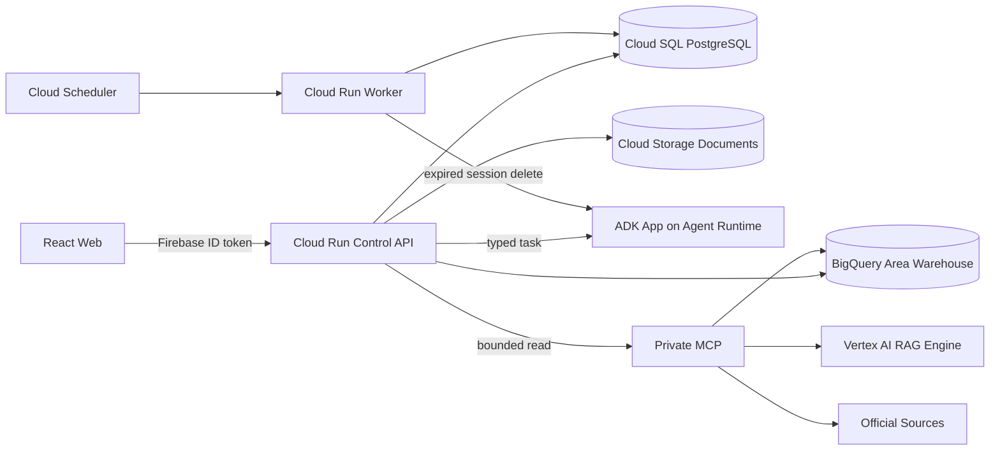

# CaffeMate 시스템 아키텍처

> 상태: draft
>
> 갱신일: 2026-08-24
>
> 구현 기준: 단일 `RUN_PROPOSAL` 제안 경로

## 1. 현재 결정

CaffeMate는 GCP 배포 단위와 Multi-Agent 경계를 유지하되, 첫 제안 요청을 여러 비동기 단계로
쪼개지 않는다. 사용자가 분석을 시작하면 Control API가 한 트랜잭션에서 후보 생성, 재무 계산,
자금 Gate, 순위, 결과 저장을 끝낸다.

배포 단위는 다음과 같다.

1. `caffemate-web`: React 사용자 화면
2. `caffemate-api`: 인증, 권위 State, 제안 실행, 계산, 결과와 유일한 State 쓰기 권한
3. `caffemate-worker`: Agent Runtime 세션 정리와 운영 실패 레코드 관리
4. `caffemate-mcp`: 공식 자료와 프로젝트 자료를 읽는 비공개 도구 서비스
5. `caffemate-agents`: 비정형 입력을 구조화하는 ADK Multi-Agent 애플리케이션

첫 제안에는 Pub/Sub stage queue, stage lease, heartbeat, redelivery와 단계별 validator를 사용하지
않는다. Worker도 첫 제안 실행에 참여하지 않는다.

## 2. 구조도



## 3. 권위 경계

- React Web은 공개 Control API만 호출한다.
- Agent와 MCP는 권위 State를 직접 수정하지 않는다.
- Agent는 구조화된 제안만 반환하고, MCP는 조회 결과만 반환한다.
- Control API가 Schema, 프로젝트 범위, 근거, 계산 규칙을 검증한 뒤 State와 결과를 저장한다.
- 재무 계산, 자금 Gate, 순위와 결과 선택은 결정론적 코드가 담당한다.
- Agent가 반환한 숫자를 검증 없이 비용이나 순위에 사용하지 않는다.
- 사용자별 프로젝트와 문서는 `user_id`와 `project_id`로 격리한다.

## 4. 첫 제안 실행

외부 API는 기존 화면 계약을 유지한다.

```text
POST /v1/projects/{project_id}/workflows/FIRST_PROPOSAL
GET  /v1/projects/{project_id}/workflows/{workflow_run_id}
GET  /v1/projects/{project_id}/result
```

내부 실행은 다음 한 경로다.

```text
인증과 프로젝트 소유권 확인
→ 현재 Venture State 잠금
→ 등록된 개인카페 모델과 프랜차이즈 기준 로드
→ 수용된 Evidence 투영
→ 후보별 결정론적 재무 계산
→ 자금 Gate와 다음 검토 우선순위 계산
→ 결과와 RUN_PROPOSAL 성공 기록을 한 트랜잭션에 저장
→ 완료된 workflow와 결과 반환
```

`FirstProposalService.run()`이 첫 제안의 단일 진입점이다. 한 번의 실행은 정확히 하나의
`RUN_PROPOSAL` 기록을 만든다. 삭제된 13단계 Workflow 이름이나 순서를 새로운 코드와 문서에
다시 도입하지 않는다.

### 4.1 후보 생성

- 개인카페는 버전이 고정된 소형 포장형, 중소형 균형형, 좌석형 기준을 사용한다.
- 프랜차이즈는 개인 가맹 적격성과 공식 가맹 안내가 확인된 등록 브랜드만 사용한다.
- 첫 제안의 기준값은 확정 점포 사실이 아니라 출처가 구분된 공식 값 또는 등록 가정이다.
- Control API는 사용자의 선호에 맞는 후보를 최대 세 개까지 계산하고 비교한다.
- 근거가 부족해도 후보를 비워 두지 않으며, 부족한 근거와 확인할 항목을 결과에 표시한다.
- 후보 ID는 프로젝트·유형·등록 모델 또는 브랜드로 정하며 State version이 바뀌어도 같은 창업안은
  같은 ID를 유지한다. 결과 snapshot의 시점은 별도 `state_version`으로 구분한다.

### 4.2 실제 점포 조건 반영

```text
후보 선택
→ 실제 점포의 보증금·월세·관리비·권리금 입력
→ 선택 후보의 같은 비용 항목만 교체
→ 초기 필요자금·월 고정비·손익분기 매출 재계산
→ 이전 결과와 변경 결과 저장
```

개인카페와 프랜차이즈 모두 같은 재계산 규칙을 사용한다. 실제 점포 입력은
`property-input:{id}` 근거로 남으며 다른 후보의 비용에는 영향을 주지 않는다. 이후 자연어 피드백,
문서 반영 또는 근거 갱신으로 다시 계산할 때도 Control API가 선택 후보의 최신 점포 입력을 읽어
같은 비용을 유지한다.

## 5. Multi-Agent 사용 범위

Multi-Agent 구조는 비정형 의미 판단이 필요한 기능에 유지한다.

| 역할 | 입력 | 출력 | 권위가 없는 항목 |
| --- | --- | --- | --- |
| Feedback Interpreter | 현재 결과와 자연어 피드백 | typed 변경 제안 | State 확정 쓰기 |
| Document Extractor | 문서 block과 문서 종류 | 수정 가능한 추출 폼 | 비용 확정과 법률 판단 |
| Evidence Researcher | 제한된 근거 후보와 Claim | 관계·충돌 평가 | 도구 선택과 Evidence 확정 |
| Proposal Agent | 등록 후보와 근거 snapshot | 후보 구조화 제안 | 계산, Gate와 순위 |
| Independent Critic | 후보·계산·근거 snapshot | 위험과 누락 점검 | 후보 값 변경 |

모든 역할은 하나의 ADK 애플리케이션 안에서 독립적인 typed task로 실행한다. Agent 간 자유 대화,
Agent 간 네트워크 호출과 권위 데이터베이스 쓰기는 허용하지 않는다. 현재 단순 첫 제안은 Agent
응답을 기다리지 않고도 결과를 만들며, 위 역할은 자연어 피드백·문서 입력과 별도 품질 강화 경계에
사용한다.

## 6. MCP와 Advanced RAG

MCP는 Control API만 호출할 수 있는 read-only data plane이다.

- `resolve_area`: 구조화 지역 후보 조회
- `get_area_profile`: 승인된 지역 snapshot 조회
- `search_cafe_observations`: 카페 업소와 상권 관측 조회
- `retrieve_official_documents`: Vertex AI RAG Engine의 공식 문서 검색
- `list_franchise_universe`: 등록 프랜차이즈와 가맹 적격성 근거 조회

RAG 검색 결과는 곧바로 확정 Evidence가 아니다. Control API가 원문 주소, 문서 revision, anchor,
지역 범위, 기준일과 프로젝트 범위를 확인한 뒤 수용된 Evidence만 결과에 투영한다. 첫 제안은 실행
중에 검색을 반복하지 않고, 이미 수용된 Evidence와 승인 snapshot을 읽는다. 새 자료를 수집하거나
문서를 적용하면 해당 Evidence를 저장한 뒤 `RUN_PROPOSAL`을 다시 실행한다.

Vertex AI RAG Engine은 공식 문서와 프로젝트 전용 문서의 검색 계층이다. corpus와 file id는
Cloud SQL에 보관된 허용 프로젝트 mapping을 통과한 경우에만 조회한다. 근거가 없으면 내용을
생성하지 않고 `공식 문서 미확보` 또는 확인할 항목으로 남긴다.

## 7. 저장소 역할

### Cloud SQL PostgreSQL

- 사용자와 창업 검토 프로젝트
- versioned Founder·Area·Venture State
- 수용된 Evidence와 문서 revision mapping
- 후보, 재무 계산, 판단 결과와 변경 이력
- 단일 Workflow 실행 기록
- Agent session cleanup과 운영 실패 레코드

### BigQuery

- 공공데이터 원시 snapshot
- 공급자별 정규화 결과
- 행정동별 인구·카페 업소·신규·폐업·매출·유동인구 집계
- freshness, coverage와 품질 지표

BigQuery는 재생성 가능한 분석 자료를 보관하며 사용자별 transactional State를 저장하지 않는다.
MCP는 승인 manifest가 가리키는 snapshot만 읽는다.

### Cloud Storage

- 사용자 업로드 원본
- 공식 원문 revision
- OCR·layout parsing 산출물
- checksum과 immutable source identity

사용자 문서는 영구 공개 URL을 만들지 않는다. 브라우저는 Control API가 발급한 짧은 수명의 signed
URL로 전송하고, API가 파일 형식·크기·digest와 프로젝트 소유권을 확인한다.

## 8. Worker와 운영 자동화

Worker는 첫 제안을 실행하지 않는다. 현재 Python Worker의 책임은 다음 두 가지다.

1. Agent Runtime에서 삭제되지 않은 관리형 세션 정리
2. 운영 실패 레코드 조회와 명시적 재처리

Cloud Scheduler는 비공개 Worker의 `/internal/v1/agent-sessions:cleanup`만 호출한다. Worker는 public
invoker를 허용하지 않는다. 문서 parsing·indexing 모듈은 별도 파이프라인 경계에 유지하며, 실제
배포 경로가 연결되기 전에는 Worker가 이를 운영한다고 표현하지 않는다.

## 9. 실패 원칙

- 첫 제안은 외부 모델이나 검색 서비스의 응답을 기다리지 않으므로 해당 장애 때문에 중단되지 않는다.
- 수용된 근거가 없으면 숫자나 출처를 생성하지 않고 등록 가정과 미확인 항목을 구분한다.
- Agent, MCP와 문서 처리 실패는 호출 기능에서 명시적인 오류로 반환하며 다른 모델이나 자료로
  조용히 전환하지 않는다.
- 같은 요청을 숨겨서 반복 실행하는 timeout·fallback을 기본 설계로 사용하지 않는다.
- State 손상, 프로젝트 격리 위반, 계약 위반과 계산 불능은 즉시 실패한다.
- 후보, 계산과 결과는 같은 트랜잭션에서 저장하므로 중간 결과가 현재 결과가 되지 않는다.

## 10. 인증과 권한

- Identity Platform ID token을 Control API에서 검증한다.
- API, Worker, MCP와 Agent Runtime은 별도 service identity를 사용한다.
- MCP invoke 권한은 Control API identity에만 부여한다.
- Worker와 MCP는 public invoker를 허용하지 않는다.
- Agent는 raw credential과 데이터베이스 쓰기 권한을 받지 않는다.
- Secret은 Secret Manager에서 runtime identity로 읽는다.
- 프로젝트 소유권을 확인하기 전에 데이터베이스·문서·RAG 검색을 실행하지 않는다.

## 11. 검증 기준

변경 완료를 판단하기 전에 다음을 확인한다.

1. 단위 테스트와 PostgreSQL 통합 테스트가 단일 `RUN_PROPOSAL`을 확인한다.
2. 개인카페와 프랜차이즈 경로가 각각 후보와 현재 결과를 만든다.
3. 후보 선택 뒤 실제 점포 입력이 해당 후보 비용만 바꾸고 결과 이력을 남긴다.
4. 자연어 피드백과 문서 적용이 새 결과를 만든다.
5. 배포 검증은 API `/health` HTTP 200과 실제 공개 요청 경로를 확인한다.
6. Worker 외부 호출은 거절되고, 인증된 Agent session cleanup 호출은 성공한다.
7. 배포 확인 전에는 운영 반영 상태를 `pending`으로 보고한다.

## 12. 분리 조건

다음 조건이 반복될 때만 모듈을 추가 서비스로 분리한다.

- 문서 처리량이 사용자 API 응답 시간을 지속적으로 침범한다.
- 공급자 credential과 API runtime 권한을 같은 identity에 둘 수 없다.
- 데이터 수집과 사용자 요청의 배포·확장 주기가 충돌한다.
- 독립 장애 격리가 없으면 목표 처리량을 만족할 수 없다.

그전에는 현재 모듈 경계와 typed contract를 유지한다.
