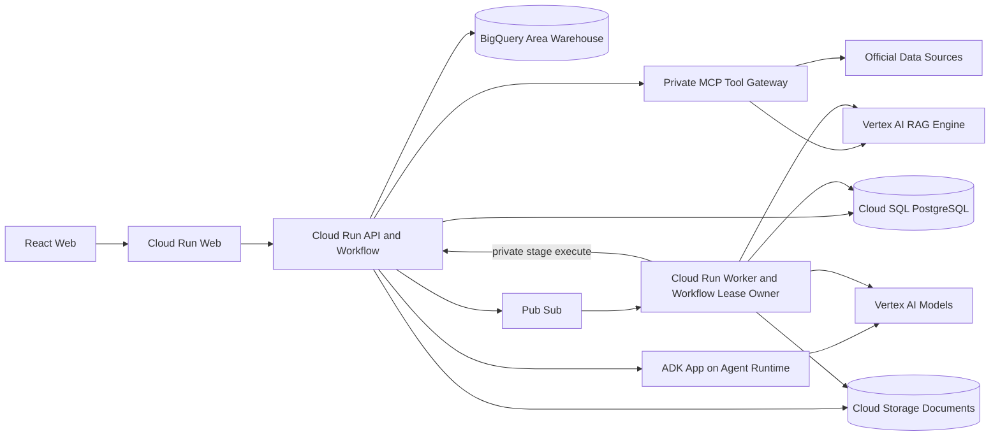

# CaffeMate 시스템 아키텍처

> 상태: draft
>
> 갱신일: 2026-08-23
>
> 구현 상태: Web·API·Worker·MCP·Agent Runtime 배포 및 운영 검증 진행 중

## 결정

초기 구현은 작은 마이크로서비스 다수가 아니라 Cloud Run 세 단위와 Agent Runtime 한 단위의 modular architecture로 시작한다.

1. `caffemate-web`: React·Tailwind 사용자 화면
2. `caffemate-api`: 인증, State, Workflow, 계산, Agent 호출과 유일한 State write 권한
3. `caffemate-worker`: durable Workflow lease·heartbeat·redelivery, 공공데이터 수집, 문서 parsing·embedding
4. `caffemate-agents`: ADK Multi-Agent application을 실행하는 managed Agent Runtime

`caffemate-mcp`는 외부 자료 접근 권한을 분리하는 private read-only Cloud Run service다. 초기에는 API와 typed tool package를 공유할 수 있지만 Agent가 데이터베이스나 공급자 API를 직접 호출하지 못하게 한다.

### CONFIRMED — GCP 리전과 Agent 배치

- 제품 지원 범위는 대한민국 전국이며, `asia-northeast3`는 GCP 배포 리전일 뿐 서비스 대상 지역이 아니다.
- Web, API, Worker, MCP와 사용자별 State·문서의 기본 배치 리전은 `asia-northeast3`로 통일한다.
- ADK Agent들은 각각 서버로 배포하지 않고 하나의 Multi-Agent application으로 묶어 `asia-northeast3` Agent Runtime에 배포한다.
- Control API가 IAM 인증으로 Agent Runtime을 직접 호출한다. 서울 리전에서 지원되지 않는 managed Agent Gateway를 필수 경로에 두지 않는다.
- 첫 구현에서는 Control API만 private MCP를 호출한다. Agent Runtime은 MCP invoke 권한을 갖지 않고 typed proposal만 반환하며 State write는 계속 API만 수행한다.
- 생성 모델은 `global` endpoint의 `gemini-3.7-flash`로 고정하고, embedding·reranker는 `asia-northeast3`로 유지한다. `global`은 fallback이 아니라 승인된 생성 위치다.
- `gemini-3.7-flash`는 2026-08-21 실제 `global` `generateContent` 호출에서 HTTP 200과 `STOP` 응답을 확인한 뒤 사용자 승인을 받아 pin했다.
- 실제 사용할 서울 Runtime·global 생성·서울 embedding·서울 reranker는 배포 전에 각각 호출 read-back을 통과해야 한다. 실패하면 `BLOCKED_BY_REGION`으로 중단하며 다른 위치로 조용히 전환하지 않는다.
- Vertex AI RAG Engine을 공식·프로젝트 문서 Advanced RAG의 주 검색 계층으로 사용한다. 서울 Preview 위험은 수용하되 corpus 생성·import·retrieval·rerank read-back을 배포 Gate로 두고 다른 검색기로 조용히 우회하지 않는다.

## 구조도

[편집 가능한 FigJam 구조도](https://www.figma.com/board/0n3ylTTNnzH29kP9Ywi6nR?architecture=true)



## 배포 단위

| Unit | 책임 | 확장 기준 | 외부 공개 |
| --- | --- | --- | --- |
| Web | 정적 앱과 client routing | 정적 요청량 | 공개 |
| API | 인증, 프로젝트, Workflow, reducer, 계산, 결과 | 동기 요청량 | 인증 API만 공개 |
| Worker | 모든 durable Workflow의 lease·heartbeat·redelivery, 문서·embedding·수집 작업 | queue backlog | 비공개 |
| Agent Runtime | ADK 역할 실행, 근거 평가와 proposal·audit | Agent run과 model latency | 비공개 |
| MCP | 공식·프로젝트 자료 read tools | tool latency·권한 경계 | 비공개 |

API 내부 모듈은 독립 테스트가 가능해야 하지만 첫 구현에서 각각 별도 서비스로 배포하지 않는다.

Agent Runtime은 의미 판단을 담당하지만 Workflow 생존권이나 권위 State를 소유하지 않는다.
결정론적으로 대체할 수 없는 `EVIDENCE_ASSESS` 실패를 가짜 `ABSTAIN` 성공으로 바꾸지 않는다.
Control API는 원래 Runtime code와 trace를 가진 명시적 Stage 실패로 남기고 어떤 조회 record도
Evidence로 승격하지 않는다. 모델·endpoint·리전을 바꾸는 자동 fallback도 계속 금지한다.

Agent 호출은 역할별로 최적화한다. Control API는 전체 MCP 저장본에서 의미 판정에 필요한 rerank
상위 Evidence만 투영하고, Runtime은 task별 사고 수준·출력 토큰·deadline을 release manifest에서
고정한다. `EVIDENCE_ASSESS`는 bounded 분류 작업이므로 `low` 사고 수준과 최대 2,048 출력 토큰,
60초 deadline을 사용한다. Proposal과 Candidate Audit도 제한된 seed·Evidence·계산 snapshot을
구조화하는 역할이며, 비용 계산·Gate·순위·계약 검증은 결정론적 코드가 담당한다. 따라서 두 역할은
`low` 사고 수준과 최대 4,096 출력 토큰을 사용한다. 문서 추출은 긴 문서 block의 의미 연결이
필요하므로 `medium`을 유지한다. Runtime은 task type, 요청 byte, 지연, 종료 사유와 provider token usage만
구조화 log로 남기며 사용자 입력·Evidence 본문·프로젝트·세션 식별자는 기록하지 않는다. 모델
출력의 Schema·echo·의미 검증은 Runtime 내부에서 이뤄지므로, 거절된 첫 출력은 같은 관리형 실행
안에서 validator error를 사용해 한 번만 수리한다. 두 번째 실패를 반복 생성이나 성공값으로
바꾸지 않는다.

2026-08-23 운영 기준선에서는 `EVIDENCE_ASSESS`, `PROPOSE_INDEPENDENT`, `CANDIDATE_AUDIT`가
각각 5.333초, 14.089초, 12.020초에 첫 생성으로 `STOP`하고 전체 계약을 통과했다. 같은 모델과
계약 fixture를 `low` 사고 수준·4,096 출력 토큰으로 각각 두 번 실행한 비교 실험에서는 Proposal이
3.749~4.094초, Candidate Audit이 3.335~3.360초에 모두 첫 생성으로 Schema와 의미 검증을 통과했다.
이는 Agent를 제거하거나 응답을 기다리지 않는 fallback이 아니라, 권위 계산을 하지 않는 typed 역할의
추론 예산을 실제 관측값에 맞춘 것이다. 배포 canary에서 repair가 발생하거나 결과 계약 통과율이
낮아지면 해당 역할만 `medium`으로 되돌리는 것이 이 결정의 폐기 조건이다.

Agent Runtime 검증용 13단계 canary는 실제 UI 계약처럼 이미 선택된 법정동 `AreaState`에서
시작한다. 주소 공급자 장애 때문에 Agent가 한 번도 실행되지 않은 실패를 Agent 지연으로 집계하지
않는다. 주소 검색 자체는 별도 MCP 검증에서 버전이 붙은 전국 법정동 자료의 무네트워크 조회와
상세 주소 보조 API의 `PARTIAL` 실패 동작을 검사한다.

```text
api/
├── auth
├── projects
├── state
├── workflows
├── evidence
├── candidates
├── finance
├── decisions
├── agents
└── guardrails
```

## 저장소 역할

### Cloud SQL PostgreSQL

- 사용자와 창업 검토 프로젝트
- versioned Founder·Area·Venture State
- Evidence, Claim, Conflict
- Candidate, Calculation, Risk, Decision snapshot
- Workflow run과 feedback proposal
- 문서 metadata·chunk·embedding

PostGIS는 행정동·생활권·점포 관측의 공간 결합에 사용한다. Cloud SQL은 RAG corpus·file id와 document revision·원문 anchor·Evidence의 대응 관계를 저장하지만 문서 vector serving의 주 계층은 아니다.

### BigQuery

- 공공데이터 원시 snapshot
- 공급자별 정규화 결과
- 행정동별 인구·연령·사업체·카페 관측 집계
- freshness·coverage·중복 품질 지표

BigQuery는 분석·재생성 가능한 자료를 보관한다. 사용자별 transactional State를 저장하지 않는다.

### Cloud Storage

- 공식 원문 revision
- 사용자 업로드 원본
- OCR·layout parsing 산출물
- checksum과 immutable source identity

사용자 문서는 project 경로와 IAM으로 격리한다. 영구 공개 URL을 만들지 않는다.

### Vertex AI RAG Engine

- 공식 문서·정보공개서와 project-private 문서 corpus
- Document AI Layout Parser 기반 import·chunking·embedding
- metadata filter·semantic retrieval·rerank
- corpus·file id는 Cloud SQL의 허용 project mapping을 통과한 경우에만 조회

RAG 검색 결과는 Evidence가 아니라 Evidence 후보다. MCP와 Control API가 원문 anchor·scope·freshness를 검증한 뒤에만 Evidence ledger에 반영한다.

## Stage 실행 경로

```text
Identity token 검증
→ project ownership 검증
→ workflow·stage·outbox transaction
→ 202 반환
→ Worker lease 획득
→ private API stage execute
→ current full head 고정
→ read-only MCP·retrieval
→ validated tool result를 Agent 입력으로 전달
→ typed Agent proposal
→ deterministic calculation·Gate
→ Critic
→ reducer validation
→ versioned atomic commit
→ stage compare-and-swap
→ 다음 outbox 또는 Candidate Result
```

## 비동기 경로

```text
API가 workflow_run·stage_run·idempotency·outbox를 한 transaction으로 기록
→ Pub/Sub
→ Eventarc
→ Worker가 stage lease·heartbeat 소유
→ Agent·MCP stage는 private API 실행 endpoint 호출
→ parsing·embedding stage는 Worker 실행
→ API reducer가 full head 검증 후 checkpoint
→ 다음 stage outbox
```

공개 API는 DB outbox commit 전 `202`를 반환하지 않는다. Worker는 Agent Runtime·MCP credential을 갖지 않고, 이 두 호출은 계속 Control API만 수행한다. 비동기 결과는 요청 시 고정한 full head 여덟 차원과 일치할 때만 적용한다. timeout·cancel 이후 결과는 head가 같아도 폐기한다.

## 인증과 권한

- Identity Platform ID token을 API에서 검증한다.
- 모든 object는 `user_id`와 `project_id` scope를 가진다.
- API, Worker, MCP와 Agent Runtime은 별도 service identity를 사용한다.
- MCP와 Worker는 public invoker를 허용하지 않는다.
- MCP invoke 권한은 Control API identity에만 부여한다.
- Agent는 raw credential을 받지 않는다.
- Secret은 Secret Manager에서 runtime identity로 읽는다.
- project ownership 검증 전 데이터베이스·문서 검색을 실행하지 않는다.

## 네트워크와 실패 원칙

- 공식 자료 호출은 allowlist된 connector로 제한한다.
- connector timeout은 재시도 예산을 넘으면 `ERROR` 또는 `STALE`로 끝낸다.
- 외부 모델 실패가 기존 State를 손상하지 않는다.
- candidate·calculation·decision은 성공 branch에서 함께 commit한다.
- partial Agent output을 정상 결과로 저장하지 않는다.

## GCP 구현 근거

- [Cloud SQL PostgreSQL extensions](https://docs.cloud.google.com/sql/docs/postgres/extensions)
- [Cloud SQL vector embeddings](https://docs.cloud.google.com/sql/docs/postgres/generate-manage-vector-embeddings)
- [Cloud Run Pub/Sub triggers](https://docs.cloud.google.com/run/docs/triggering/pubsub-triggers)
- [Cloud Run service-to-service authentication](https://docs.cloud.google.com/run/docs/authenticating/service-to-service)
- [BigQuery geospatial data](https://docs.cloud.google.com/bigquery/docs/geospatial-data)
- [Identity Platform users and tokens](https://docs.cloud.google.com/identity-platform/docs/concepts-manage-users)
- [Cloud Storage signed URLs](https://docs.cloud.google.com/storage/docs/access-control/signing-urls-with-helpers)
- [Agent Platform supported locations](https://docs.cloud.google.com/gemini-enterprise-agent-platform/resources/agent-locations)
- [Agent Platform model locations](https://docs.cloud.google.com/gemini-enterprise-agent-platform/resources/locations)
- [RAG Engine overview and locations](https://docs.cloud.google.com/gemini-enterprise-agent-platform/build/rag-engine/rag-overview)

위 문서는 설계 가능성의 근거다. 실제 GCP resource가 생성됐다는 증거가 아니다.

## 분리 조건

다음 중 하나가 반복되면 API 내부 모듈을 별도 서비스로 분리한다.

- 문서 처리가 동기 API latency를 지속적으로 침범
- MCP 공급자 credential과 API runtime 권한을 같은 identity에 둘 수 없음
- ingestion과 사용자 요청의 배포·확장 주기가 충돌
- 독립 장애 격리 없이는 목표 가용성을 만족할 수 없음

그 전에는 module boundary와 interface만 유지한다.
