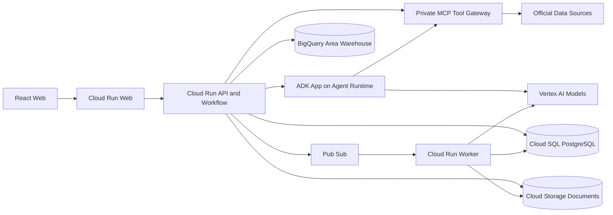

# CaffeMate 시스템 아키텍처

> 상태: draft
>
> 갱신일: 2026-08-21
>
> 구현 상태: frontend 외 구성요소는 아직 배포되지 않음

## 결정

초기 구현은 작은 마이크로서비스 다수가 아니라 Cloud Run 세 단위와 Agent Runtime 한 단위의 modular architecture로 시작한다.

1. `caffemate-web`: React·Tailwind 사용자 화면
2. `caffemate-api`: 인증, State, Workflow, 계산, Agent 호출과 유일한 State write 권한
3. `caffemate-worker`: 공공데이터 수집, 문서 parsing·embedding과 비동기 처리
4. `caffemate-agents`: ADK Multi-Agent application을 실행하는 managed Agent Runtime

`caffemate-mcp`는 외부 자료 접근 권한을 분리하는 private read-only Cloud Run service다. 초기에는 API와 typed tool package를 공유할 수 있지만 Agent가 데이터베이스나 공급자 API를 직접 호출하지 못하게 한다.

### CONFIRMED — GCP 리전과 Agent 배치

- 제품 지원 범위는 대한민국 전국이며, `asia-northeast3`는 GCP 배포 리전일 뿐 서비스 대상 지역이 아니다.
- Web, API, Worker, MCP와 사용자별 State·문서의 기본 배치 리전은 `asia-northeast3`로 통일한다.
- ADK Agent들은 각각 서버로 배포하지 않고 하나의 Multi-Agent application으로 묶어 `asia-northeast3` Agent Runtime에 배포한다.
- Control API가 IAM 인증으로 Agent Runtime을 직접 호출한다. 서울 리전에서 지원되지 않는 managed Agent Gateway를 필수 경로에 두지 않는다.
- Agent Runtime과 MCP는 서로 다른 전용 service identity를 사용한다. Agent Runtime은 허용된 read-only MCP tool만 호출하며 State write는 계속 API만 수행한다.
- 실제 사용할 Gemini model과 embedding model은 배포 전에 `asia-northeast3` 지원 여부를 read-back으로 확인한다. 지원되지 않는 모델을 이유로 사용자 데이터 plane 전체를 다른 리전으로 옮기지 않는다.
- 서울 리전에서 Preview인 RAG Engine은 운영 필수 의존성으로 사용하지 않는다. 첫 운영 RAG는 Cloud SQL PostgreSQL full-text search와 pgvector를 사용하며 RAG Engine은 교체 가능한 adapter 뒤에서만 실험한다.

## 구조도

[편집 가능한 FigJam 구조도](https://www.figma.com/board/0n3ylTTNnzH29kP9Ywi6nR?architecture=true)



## 배포 단위

| Unit | 책임 | 확장 기준 | 외부 공개 |
| --- | --- | --- | --- |
| Web | 정적 앱과 client routing | 정적 요청량 | 공개 |
| API | 인증, 프로젝트, Workflow, reducer, 계산, 결과 | 동기 요청량 | 인증 API만 공개 |
| Worker | 문서·embedding·수집 작업 | queue backlog | 비공개 |
| Agent Runtime | ADK 역할 실행, tool 계획, 근거 기반 proposal·critic | Agent run과 model latency | 비공개 |
| MCP | 공식·프로젝트 자료 read tools | tool latency·권한 경계 | 비공개 |

API 내부 모듈은 독립 테스트가 가능해야 하지만 첫 구현에서 각각 별도 서비스로 배포하지 않는다.

```text
api/
├── auth
├── projects
├── state
├── workflows
├── evidence
├── candidates
├── finance
├── decisions
├── agents
└── guardrails
```

## 저장소 역할

### Cloud SQL PostgreSQL

- 사용자와 창업 검토 프로젝트
- versioned Founder·Area·Venture State
- Evidence, Claim, Conflict
- Candidate, Calculation, Risk, Decision snapshot
- Workflow run과 feedback proposal
- 문서 metadata·chunk·embedding

PostGIS는 행정동·생활권·점포 관측의 공간 결합에 사용한다. PostgreSQL full-text search와 pgvector는 공식·프로젝트 corpus의 MVP hybrid retrieval에 사용한다.

### BigQuery

- 공공데이터 원시 snapshot
- 공급자별 정규화 결과
- 행정동별 인구·연령·사업체·카페 관측 집계
- freshness·coverage·중복 품질 지표

BigQuery는 분석·재생성 가능한 자료를 보관한다. 사용자별 transactional State를 저장하지 않는다.

### Cloud Storage

- 공식 원문 revision
- 사용자 업로드 원본
- OCR·layout parsing 산출물
- checksum과 immutable source identity

사용자 문서는 project 경로와 IAM으로 격리한다. 영구 공개 URL을 만들지 않는다.

## 동기 요청 경로

```text
Identity token 검증
→ project ownership 검증
→ current State version 고정
→ Workflow 선택
→ read-only MCP·retrieval
→ Agent candidate
→ deterministic calculation·Gate
→ Critic
→ reducer validation
→ versioned atomic commit
→ Candidate Result 반환
```

## 비동기 경로

```text
API가 document·ingestion task 발행
→ Pub/Sub
→ Eventarc
→ Worker
→ parsing·embedding·validation
→ proposed Claim 또는 Evidence 저장
→ API Workflow가 후속 재계산
```

비동기 결과는 요청 시 고정한 project·State·document version과 일치할 때만 적용한다. 늦게 도착한 이전 version 결과는 자동 적용하지 않는다.

## 인증과 권한

- Identity Platform ID token을 API에서 검증한다.
- 모든 object는 `user_id`와 `project_id` scope를 가진다.
- API, Worker, MCP는 별도 service identity를 사용한다.
- MCP와 Worker는 public invoker를 허용하지 않는다.
- Agent는 raw credential을 받지 않는다.
- Secret은 Secret Manager에서 runtime identity로 읽는다.
- project ownership 검증 전 데이터베이스·문서 검색을 실행하지 않는다.

## 네트워크와 실패 원칙

- 공식 자료 호출은 allowlist된 connector로 제한한다.
- connector timeout은 재시도 예산을 넘으면 `ERROR` 또는 `STALE`로 끝낸다.
- 외부 모델 실패가 기존 State를 손상하지 않는다.
- candidate·calculation·decision은 성공 branch에서 함께 commit한다.
- partial Agent output을 정상 결과로 저장하지 않는다.

## GCP 구현 근거

- [Cloud SQL PostgreSQL extensions](https://docs.cloud.google.com/sql/docs/postgres/extensions)
- [Cloud SQL vector embeddings](https://docs.cloud.google.com/sql/docs/postgres/generate-manage-vector-embeddings)
- [Cloud Run Pub/Sub triggers](https://docs.cloud.google.com/run/docs/triggering/pubsub-triggers)
- [Cloud Run service-to-service authentication](https://docs.cloud.google.com/run/docs/authenticating/service-to-service)
- [BigQuery geospatial data](https://docs.cloud.google.com/bigquery/docs/geospatial-data)
- [Identity Platform users and tokens](https://docs.cloud.google.com/identity-platform/docs/concepts-manage-users)
- [Cloud Storage signed URLs](https://docs.cloud.google.com/storage/docs/access-control/signing-urls-with-helpers)
- [Agent Platform supported locations](https://docs.cloud.google.com/gemini-enterprise-agent-platform/resources/agent-locations)
- [Agent Platform model locations](https://docs.cloud.google.com/gemini-enterprise-agent-platform/resources/locations)
- [RAG Engine overview and locations](https://docs.cloud.google.com/gemini-enterprise-agent-platform/build/rag-engine/rag-overview)

위 문서는 설계 가능성의 근거다. 실제 GCP resource가 생성됐다는 증거가 아니다.

## 분리 조건

다음 중 하나가 반복되면 API 내부 모듈을 별도 서비스로 분리한다.

- 문서 처리가 동기 API latency를 지속적으로 침범
- MCP 공급자 credential과 API runtime 권한을 같은 identity에 둘 수 없음
- ingestion과 사용자 요청의 배포·확장 주기가 충돌
- 독립 장애 격리 없이는 목표 가용성을 만족할 수 없음

그 전에는 module boundary와 interface만 유지한다.
