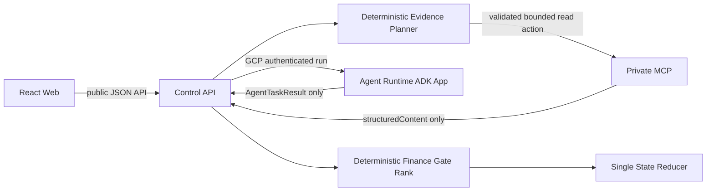

# CaffeMate 백엔드·Agent Runtime 연결 계약

> 상태: active implementation contract
>
> 계약 버전: `1.1.0`
>
> 제품 정본: [제품 명세](../product-spec.md)
>
> 기술 기준: [Agent·RAG 런타임 상세 계약](../product-very-spec.md)
>
> 갱신일: 2026-08-23

## 1. 목적과 권한

이 문서는 다음 세 경계의 구현 계약이다.

1. Control API가 GCP Agent Runtime을 호출하는 방법
2. Control API가 Agent 결과를 검증하고 Workflow에 반영하는 방법
3. Control API가 private MCP에서 근거 자료를 읽는 방법

제품 행동은 `product-spec.md`가 우선한다. 이 문서는 제품 결정을 바꾸지 않고 서비스 사이의 전송 형식, 권한, 실패와 재시도 규칙을 고정한다. JSON 구조는 아래 기계 계약이 권위값이다.

- [Agent Task Schema](./agent-task.schema.json)
- [Agent Task Result Schema](./agent-task-result.schema.json)
- [Agent Role Payload Schema](./agent-role-payloads.schema.json)
- [공통 Typed Value Schema](./common-types.schema.json)
- [MCP Tool Contract Schema](./mcp-tool-contracts.schema.json)
- [MCP Tool Manifest](./mcp-tool-manifest.json)
- [Venture State Schema](./venture-state.schema.json)
- [Evidence Record Schema](./evidence-record.schema.json)
- [Candidate Result Schema](./candidate-result.schema.json)
- [Document Extraction Form Schema](./document-extraction-form.schema.json)

## 2. 소유권과 변경 승인

| 경계 | Producer | Consumer·권위자 | 변경 승인 |
| --- | --- | --- | --- |
| 공개 API 응답 | Control API | React Web | 김민석 + 유시우 |
| `AgentTask` | Control API | Agent Runtime adapter | 김민석 + 이민우 |
| `AgentTaskResult` | Agent Runtime | Control API validator | 이민우 + 김민석 |
| MCP tool request | Control API | MCP server | 김민석 + 이민우 |
| MCP `structuredContent` | MCP server | Control API | 이민우 + 김민석 |
| State·Calculation·Gate·rank | Control API deterministic core | React Web·Agent 입력 snapshot | 김민석 |
| Prompt·role payload | Agent Runtime | Control API semantic validator | 이민우 + 김민석 |

Producer는 Schema, 정상 fixture, 실패 fixture와 consumer 영향 변경을 같은 풀 리퀘스트에 포함한다. Consumer owner는 문서만 읽고 승인하지 않고 실제 parser·generated type 또는 contract test와 대조한다.

## 3. 고정 연결 구조



### 3.1 확정 경계

- React Web은 Agent Runtime과 MCP를 직접 호출하지 않는다.
- 다섯 Agent는 하나의 ADK application에 배포한다.
- Agent 간 자유 대화, Agent 간 네트워크 호출과 A2A는 사용하지 않는다.
- Control API가 고정 DAG, 실행 Agent, 입력 snapshot, 재시도와 종료를 결정한다.
- Agent는 typed proposal만 반환한다. State·Evidence·Calculation·Gate·rank를 쓰지 않는다.
- MCP는 read-only data plane이다. 추천·계산·write tool을 제공하지 않는다.
- 첫 구현에서 Agent Runtime은 MCP를 직접 호출하지 않는다.
- Control API는 Claim 종류별 버전형 규칙으로 support·counter read action을 결정한다. Agent가
  도구, 지역 코드, 날짜 범위, query 상한을 선택하지 않는다.
- 동일한 Claim Plan과 MCP manifest에는 같은 action plan과 digest가 생성되어야 한다.
- Control API가 allowlist와 typed arguments를 검증해 MCP를 실행하고 결과를 Evidence
  Researcher의 `ASSESS` 입력으로 전달한다.

이 경계로 Agent의 잘못된 tool 선택이 권한 실행으로 바로 이어지는 것을 막고, MCP 호출을 같은 Workflow trace와 project fence 안에서 재현할 수 있게 한다.

## 4. Agent Runtime 물리 전송

### 4.1 현재 배포 가능 상태

`asia-northeast3` Agent Runtime 배치는 유지한다. 생성 모델은 사용자 승인에 따라 `global` endpoint의 `gemini-3.7-flash`로 고정하며, 2026-08-21 `global` `generateContent` 실호출에서 HTTP 200과 `STOP` 응답을 확인했다. RAG Engine과 embedding은 계속 `asia-northeast3`를 사용한다.

- 서울 Runtime을 다른 리전으로 자동 변경하지 않는다. Agent Runtime 자체를 `global`에 배치하지 않는다.
- `global`은 승인된 생성 위치이며 fallback이 아니다. 생성 실패 시 regional endpoint로 조용히 전환하지 않는다.
- Runtime 생성, `global` 생성 모델 호출, 서울 embedding 호출, 서울 reranker 호출을 서로 독립된 배포 preflight로 실행한다.
- 네 항목 중 필수 항목 하나라도 고정된 위치에서 실패하면 Agent Workflow를 시작하지 않고 대체 위치 호출 수가 0임을 검증한다.
- release manifest에는 Runtime region과 generation region을 분리해 pin한다.
- release manifest는 운영 검색에 사용할 `ACTIVE IndexGeneration`의 exact RAG corpus resource, ACTIVE RAG file set, parser·index schema revision, embedding model, reranker, source revision set과 sealed evaluation digest를 함께 pin한다. 배포 preflight는 display name으로 corpus를 재탐색하지 않고 이 exact resource와 file set을 read-back한다.
- RAG gold set과 수치 Gate가 고정되기 전 `sealed_evaluation_digest`는 `docs/evaluation/high-value-cases.yaml`의 provisional sealed evaluation input identity를 pin한다. 이 digest 자체를 성능 통과 증거로 해석하지 않으며, 현재 release 승격에는 exact corpus/file read-back과 실제 retrieval·rerank preflight 성공이 별도로 필요하다.
- prompt와 Agent payload contract의 content digest는 소스에서 계산할 뿐 아니라 배포된 Runtime의 preflight 전용 `async_get_release_identity`를 호출해 artifact 내부 값도 read-back한다. manifest·source·Runtime 중 하나라도 다르면 release 승격을 막는다.
- private MCP도 release manifest에 Cloud Run service name·region·40자 source revision·immutable image digest를 함께 pin하고, Agent GCP preflight가 Cloud Run v2 service를 직접 GET해 template label과 단일 container image를 authoritative read-back한다. protocol/tool manifest가 같아도 runtime artifact가 다르면 release 승격을 막는다.

### 4.2 GCP endpoint와 관리형 session

Control API의 물리 설정은 `gcp_project_id`와 `resource_id`를 분리한다. 제품의 `venture_project_id`를 GCP endpoint 조립에 사용하지 않는다.

한 invocation은 Control API에서 Agent Runtime으로 한 번의
`async_ephemeral_stream_query`만 호출한다. Runtime adapter가 그 요청 안에서 다음 순서를 지킨다.

1. Control API가 지정한 비식별 session id로 ADK 관리형 session을 생성하고 반환 id를 검증한다.
2. 정확히 그 session에서 한 AgentTask를 실행하고 terminal event까지 스트리밍한다.
3. 성공·Agent 오류·사용자 취소 모두에서 generator `finally`가 session을 삭제한다.
4. 삭제가 끝나야 stream을 닫는다. 삭제 실패는 `RUNTIME_SESSION_CLEANUP_FAILED`로 명시하고
   Control API가 deterministic session id를 durable cleanup outbox에 넣어 멱등 재시도한다.

이 결합은 Agent 응답을 기다리지 않는 비동기 우회가 아니다. Control API는 여전히 final event와
Runtime 내부 session 삭제 완료까지 기다린다. 단지 동일 Runtime에 대한 외부 HTTPS 왕복을
`create → stream → delete` 세 번에서 한 번으로 줄인다. Proposal Agent와 Independent Critic은
서로 다른 invocation id와 session id를 계속 사용하므로 독립적인 추론 문맥도 유지된다.

운영 검증은 Control API identity로 ephemeral stream을 실제 호출해 session 생성·Agent 실행·typed
final 검증·삭제가 모두 끝난 경우에만 통과한다. 이어 FIRST_PROPOSAL canary에서 세 역할의 generation
telemetry와 validation telemetry가 모두 존재하고 Stage attempt가 1인지 확인한다. 2026-08-23
검증에서는 세 역할 모두 `STOP`, repair 0, `VALID`였고 13단계가 47.917초에 끝났다.

`async_get_release_identity`는 사용자 invocation 경로가 아닌 배포 preflight 전용 read-only class method다. session을 생성하거나 제품 State를 읽고 쓰지 않으며, 배포 artifact가 직접 계산한 `prompt_bundle_digest`와 `agent_contract_bundle_digest`만 반환한다. Control API의 정상 Agent 호출 순서는 위 세 class method만 사용한다.

```text
POST https://asia-northeast3-aiplatform.googleapis.com/v1/projects/{gcp_project_id}/locations/asia-northeast3/reasoningEngines/{resource_id}:streamQuery?alt=sse
class_method=async_ephemeral_stream_query
```

session 생성 입력의 `user_id`는 실제 사용자 식별자가 아니라 `venture_project_id`를 서버 비밀값으로 HMAC한 `p-<digest>`다. Control API는 `invocation_id`의 SHA-256 digest로 충돌하기 어려운 비식별 session id를 생성해 ephemeral stream에 전달하고 Runtime이 그 값으로 session을 만들었는지 확인한다. 이 값은 stream 응답이 deadline 때문에 유실돼도 같은 session을 durable cleanup 대상으로 지정하기 위한 식별자이며 제품 State나 사용자 식별자가 아니다. 별도 Sessions REST API와 Runtime adapter를 혼용하지 않으며 session TTL을 정상 삭제의 대체 계약으로 주장하지 않는다. 모든 `AgentTask`는 session 이력 없이 완전해야 하고 session은 제품 State나 대화 기억이 아니다.

`:streamQuery` body는 다음과 같다.

```json
{
  "class_method": "async_ephemeral_stream_query",
  "input": {
    "user_id": "p-<venture-project-hmac>",
    "session_id": "<invocation-id-derived ephemeral id>",
    "message": "<RFC 8785 canonical AgentTask JSON>"
  }
}
```

관리형 Runtime의 stream 응답은 배포 방식에 따라 `data: <event>` SSE line 또는
`{"output": <event>}` newline JSON envelope로 전달될 수 있다. Control API adapter는 줄마다
JSON object 하나만 허용하고 `output` object가 있으면 한 단계만 벗긴 뒤 동일한 final event
검증을 적용한다. 임의의 중첩 envelope, JSON이 아닌 line과 여러 final event를 정상 결과로
간주하지 않는다.

### 4.3 결정론적 root dispatcher

ADK application의 root는 LLM Agent가 아니라 custom `BaseAgent`인 `CAFFEMATE_TASK_DISPATCHER`다. 다음 매핑을 코드 상수와 release manifest로 함께 고정한다.

```text
INTENT_DELTA                         → INTENT_INTERPRETER
EVIDENCE_ASSESS                     → EVIDENCE_RESEARCHER
PROPOSE_INDEPENDENT | PROPOSE_FRANCHISE → PROPOSAL_AGENT
DOCUMENT_EXTRACT                    → DOCUMENT_ANALYST
CANDIDATE_AUDIT                     → TYPED_CANDIDATE_AUDITOR
```

dispatcher는 모델을 호출하기 전에 `AgentTask` Schema, `task_type → agent_name → prompt_version → input/output schema` 조합과 `NO_DIRECT_TOOL_CALLS`를 검증한다. 그 뒤 정확히 한 child Agent의 `run_async`만 실행한다. LLM이 역할을 고르거나 다른 Agent로 transfer하지 않으며 root 자체도 생성 모델을 호출하지 않는다.

Control API가 수용하는 final event는 다음 조건을 모두 만족해야 한다.

- ADK의 final-response 판정이 참이다.
- `author`가 dispatcher가 고른 정확한 `agent_name`이다.
- partial event가 아니다.
- `content.parts`가 정확히 한 개이고 non-empty text만 가진다.
- function call, function response, binary part와 Markdown fence가 없다.
- 한 invocation에서 위 조건을 만족하는 event가 정확히 하나다.

없거나 둘 이상이면 `RUNTIME_PROTOCOL_INVALID`다. 다른 author의 final, 중간 event와 trace text는 결과 후보가 아니다.

### 4.4 인증과 전송 adapter

- Control API 전용 service account가 OAuth access token으로 한 `:streamQuery` endpoint를 호출한다.
- Runtime adapter만 자체 관리형 session을 생성·삭제하고, 배포 service account에는 대상 Runtime query에 필요한 최소 권한만 부여한다.
- 사용자 token, MCP credential, database credential과 raw secret을 Agent 입력에 넣지 않는다.
- runtime의 Agent identity에는 모델 호출과 자체 session 외에 MCP, Cloud SQL, BigQuery, Cloud Storage, Secret Manager 권한을 주지 않는다.

전송 adapter는 `AgentTask` 검증·digest 재계산, session 수명주기, IAM 호출, final event 선택, JSON parsing, `AgentTaskResult`와 의미 규칙 검증을 담당한다. session event 전문은 일반 log에 남기지 않고 trace id·latency·status·digest만 남긴다.

## 5. 논리 요청 계약

기계 구조는 `agent-task.schema.json`을 따른다. 핵심 필드는 다음과 같다.

```yaml
schema_version: "1.0.0"
task_id: logical stage task id
invocation_id: physical call id
agent_name: one of five roles
task_type: registered task
workflow_run_id: required
stage_run_id: required
transport_attempt: 1..3
repair_attempt: 0..1
venture_project_id: required
head_fence: full immutable input fence
prompt_version: required
input_schema_id: required
output_schema_id: required
input_artifacts: []
input_digest: sha256 digest
deadline_at: UTC date-time
runtime_tool_policy: NO_DIRECT_TOOL_CALLS
tool_manifest_digest: null for active Agent tasks
payload: typed role input
trace_context: optional W3C trace context
```

### 5.1 Task registry

| `task_type` | `agent_name` | 입력 payload | 출력 payload | 최대 실행시간 |
| --- | --- | --- | --- | ---: |
| `INTENT_DELTA` | `INTENT_INTERPRETER` | current State projection, latest input, field ontology | delta proposal | 30초 |
| `EVIDENCE_ASSESS` | `EVIDENCE_RESEARCHER` | Claims, bounded validated MCP·RAG candidates | Evidence assessments·conflicts | 60초 |
| `PROPOSE_INDEPENDENT` | `PROPOSAL_AGENT` | Founder·Area snapshot, registered model seeds, Evidence | independent candidate proposals | 60초 |
| `PROPOSE_FRANCHISE` | `PROPOSAL_AGENT` | Founder·Area snapshot, verified franchise universe, Evidence | franchise candidate proposals | 60초 |
| `DOCUMENT_EXTRACT` | `DOCUMENT_ANALYST` | extraction contract, parser blocks, anchors | proposed Claims·risk flags | batch당 60초 |
| `CANDIDATE_AUDIT` | `TYPED_CANDIDATE_AUDITOR` | frozen candidate·Evidence·calculation·Gate | audit findings | 60초 |

각 row의 `input_schema_id`와 `output_schema_id`는 배포 manifest에 고정한다. Agent code를 구현하기 전에 역할별 payload Schema와 최소 정상·기권 fixture가 존재해야 한다. 이름만 맞고 payload Schema가 없는 Agent는 배포할 수 없다.

### 5.2 입력 투영 원칙

- Agent에는 전체 database row나 사용자 계정을 전달하지 않고 해당 역할에 필요한 projection만 보낸다.
- `project_id`와 fence는 권한을 부여하는 credential이 아니라 stale·cross-project 결과를 검출하는 식별자다.
- `input_artifacts`는 id·kind·version·digest를 기록한다. Agent가 id만으로 저장소를 다시 읽지는 않는다.
- 실제 판단에 필요한 내용은 검증된 `payload`에 inline으로 전달한다.
- Proposal 입력은 frozen Evidence Snapshot과 등록 seed·brand universe만 포함한다.
- Evidence Assessment 입력은 Control API가 실행하고 검증한 tool result만 포함한다.
- Document 입력은 한 revision의 허용 parser block·anchor만 포함한다.

### 5.3 `input_digest` 계산

`input_digest`는 같은 논리 입력을 재시도에서 식별하기 위한 값이다. 언어별 임의 JSON 직렬화가 아니라 [RFC 8785 JSON Canonicalization Scheme](https://www.rfc-editor.org/rfc/rfc8785)으로 canonicalize한 UTF-8 bytes에 SHA-256을 계산한다. backend와 Agent adapter는 같은 공유 test vector를 사용한다.

```text
schema_version
task_id
agent_name
task_type
workflow_run_id
stage_run_id
venture_project_id
head_fence
prompt_version
input_schema_id
output_schema_id
input_artifacts
runtime_tool_policy
tool_manifest_digest
available_tool_catalog
payload
```

`invocation_id`, `repair_of_invocation_id`, `repair_context`, `transport_attempt`, `repair_attempt`, `deadline_at`, `trace_context`와 `input_digest` 자체는 digest 대상에서 제외한다. 따라서 동일 논리 입력의 network retry와 repair는 같은 digest를 유지하고, full head·prompt·Schema·tool manifest·payload 중 하나라도 바뀌면 digest가 달라진다.

## 6. 논리 결과 계약

기계 구조는 `agent-task-result.schema.json`을 따른다.

```yaml
schema_version: "1.0.0"
task_id: echoed
invocation_id: echoed
agent_name: echoed
task_type: echoed
workflow_run_id: echoed
stage_run_id: echoed
venture_project_id: echoed
head_fence_seen: echoed full head
input_digest: echoed
output_schema_id: echoed
status: COMPLETE | NEEDS_EVIDENCE | NEEDS_HUMAN | ABSTAIN | INVALID
payload: object or null
evidence_refs: []
missing_claim_ids: []
reason_codes: []
warnings: []
```

### 6.1 Status 의미

| Status | 의미 | backend 행동 |
| --- | --- | --- |
| `COMPLETE` | 역할 payload를 완성함 | 전체 검증 뒤 다음 stage로 전달 |
| `NEEDS_EVIDENCE` | 지정 Claim의 근거가 부족함 | 필요한 근거 action 또는 조건부 결과로 전환 |
| `NEEDS_HUMAN` | 자동 해소하면 안 되는 모호성·충돌 | Workflow를 `WAITING_FOR_HUMAN`으로 전환 |
| `ABSTAIN` | 현재 입력으로 역할을 안전하게 수행할 수 없음 | 후보 수를 채우지 않고 기권 이유 기록 |
| `INVALID` | 입력 자체가 역할 계약을 위반함 | stage 실패, 원 입력 producer에 오류 반환 |

`FAILED`, `TIMEOUT`, `SAFETY_BLOCKED`, `LATE_DISCARDED`는 Agent가 주장하는 status가 아니다. Control API transport adapter가 관측한 invocation outcome으로 따로 기록한다.

### 6.2 Backend 수용 순서

결과는 다음 검사를 모두 통과해야 다음 stage 입력이 된다.

```text
GCP transport success
→ final event exactly one
→ JSON parse
→ AgentTaskResult Schema
→ task·invocation·agent·type·venture project·full head·digest echo
→ registered role payload Schema
→ Evidence and artifact reference subset
→ semantic support validator
→ product Guardrail
→ downstream deterministic calculation
```

- echo 또는 full head mismatch는 repair하지 않고 `FENCE_MISMATCH`로 폐기한다.
- Agent가 입력에 없던 Evidence id·brand id·document anchor를 반환하면 `UNSUPPORTED_REFERENCE`로 폐기한다.
- `COMPLETE`인데 required payload가 비었으면 Schema 실패다.
- 자유 문장, Markdown code fence, JSON 앞뒤 prose와 추가 top-level field는 허용하지 않는다.
- Agent 결과는 이 검사를 통과해도 persistent State가 아니다. reducer transaction 전까지 proposal이다.

### 6.3 실행 가능한 semantic invariant

JSON Schema가 두 필드 사이의 동일성, 배열 참조의 포함관계와 숫자 대소관계를 모두 표현한다고 가정하지 않는다. Control API의 단일 `validateAgentBoundary(task, result, currentHead)`가 아래 오류 코드를 반환하며 Agent adapter와 fixture도 같은 validator package를 사용한다.

| Code | 결정론적 검사 | 실패 행동 |
| --- | --- | --- |
| `FENCE_ECHO_MISMATCH` | `result.head_fence_seen`이 `task.head_fence`와 byte-equivalent인가 | 결과 폐기, repair 0 |
| `CURRENT_HEAD_MISMATCH` | 수용 직전 State·Founder·Area·Evidence·Policy·index·seed·Workflow generation이 요청 full head와 모두 같은가 | `STALE_DISCARDED`, write 0 |
| `UNALLOCATED_OUTPUT_ID` | `op_id`, `action_id`, `proposal_id`, `claim_id`가 각 입력의 backend 발급 pool·seed·universe에 있는가 | 결과 폐기 |
| `UNSUPPORTED_REFERENCE` | claim·Evidence·candidate·anchor ref가 frozen input artifact의 부분집합인가 | 결과 폐기 |
| `ASSUMPTION_USED_AS_EVIDENCE` | `DECLARED_ASSUMPTION` 또는 `UNKNOWN` id가 Evidence coverage로 쓰이지 않았는가 | 결과 폐기 |
| `EVIDENCE_SCOPE_OR_DATE_INVALID` | Evidence scope·source date·freshness가 Claim 요구와 맞는가 | 해당 Claim 미확인 처리 |
| `MCP_TOOL_CONTRACT_MISMATCH` | action의 name·version·args와 result Schema가 manifest의 같은 tool row와 맞는가 | tool 실행 또는 결과 수용 거절 |
| `MCP_PROJECT_SCOPE_MISMATCH` | MCP result의 `project_id`가 서명된 scope token과 같은가 | 403, result 0 |
| `FRANCHISE_ELIGIBILITY_UNVERIFIED` | 순위가 있는 프랜차이즈의 개인 가맹 가능 여부가 근거와 함께 `VERIFIED`인가 | `EXCLUDED`, rank null |
| `MONEY_RANGE_NON_MONOTONIC` | 알려진 비용 범위가 `low <= base <= high`인가 | 후보 계산 실패 |
| `MATERIAL_PROVENANCE_MISSING` | 추천 후보의 초기비용·고정비와 계산 입력에 material provenance가 있는가 | 최대 `CONDITIONAL_REVIEW` |
| `RANK_INVARIANT_VIOLATION` | hard Gate 통과 집합과 조건부 검토 집합이 섞이지 않고 rank가 연속·유일한가 | 전체 rank 재계산 |

`UNALLOCATED_OUTPUT_ID`를 피하기 위해 backend가 Intent의 `operation_id_pool`, Evidence plan의 `action_id_pool`, Proposal seed·brand의 `proposal_id`, 문서 추출의 `claim_id_pool`을 입력에 미리 넣는다. Agent는 새 domain id를 만들지 않는다. transport의 `invocation_id`만 adapter가 물리 호출마다 발급한다.

## 7. 중복, 재시도, 시간 초과와 취소

### 7.1 식별자

- `task_id`: 같은 Workflow generation 안의 논리 stage에 고정
- `invocation_id`: 실제 GCP 호출마다 새 값
- `transport_attempt`: 같은 logical input의 initial call과 408·429·5xx·network retry를 `1..3`으로 구분
- `repair_attempt`: 원 호출은 `0`, schema repair 호출만 `1`
- `input_digest`: payload, fence, schema와 prompt version을 포함한 canonical digest

Agent 호출은 side effect가 없으므로 동일 `task_id`가 둘 이상 실행돼도 State를 바꾸지 않는다. Worker는 `(task_id, input_digest)` unique key와 stage compare-and-swap으로 full head가 현재와 일치하는 첫 valid result만 checkpoint하고 나머지는 `DUPLICATE_DISCARDED`로 기록한다.

### 7.2 재시도 표

| 실패 | 재시도 | 처리 |
| --- | ---: | --- |
| network, HTTP 408·429·5xx | 최대 2회 | 새 `invocation_id`, 같은 `task_id`·digest, `transport_attempt` 증가 |
| JSON parse·Schema 실패 | repair 1회 | 새 invocation에 이전 response text·digest와 제한된 validator error를 `repair_context`로 전달 |
| safety block | 0회 | `SAFETY_BLOCKED` |
| HTTP 400·401·403 | 0회 | 설정·권한 오류로 실패 |
| fence·ACL·unsupported ref | 0회 | 즉시 폐기 |
| deadline 초과 | 0회 | `TIMED_OUT`, session stream 종료, 늦은 결과 폐기 |

transport backoff는 250ms, 750ms이고 invocation id에서 파생한 0~100ms jitter를 더한다. 429의 `Retry-After`는 2초 이하이면서 남은 deadline 안에 있을 때만 우선한다. Runtime 내부 session 생성, run, 삭제, response validation, repair와 cleanup enqueue까지 모두 `deadline_at` 예산에 포함하며 각 호출 직전에 남은 시간이 2초 미만이면 재시도하지 않는다. ephemeral stream은 현재 남은 logical deadline에서 durable cleanup enqueue용 2초를 제외한 값만 timeout으로 사용한다. 따라서 60초 task가 transport의 30초 상한으로 조용히 잘리지 않는다. stream이 중단되거나 Runtime이 삭제 실패를 명시하면 Control API는 해당 invocation의 deterministic session id를 cleanup outbox에 넣고 원래 실패를 보존한다.

repair는 같은 session 이력에 의존하지 않는다. `repair_context`에 직전 응답 text, 그 SHA-256 digest와 최대 50개 validator error가 반드시 들어간다. 두 번째 schema 실패는 기권으로 끝나며 세 번째 생성 호출은 없다.

Workflow 취소는 GCP 계산이 즉시 중단됐음을 보장하지 않는다. Control API가 run을 `CANCELLED`로 닫고 SSE를 사용 중이면 stream을 닫는다. timeout 또는 cancel 뒤 도착한 결과는 full head가 같아도 무조건 폐기한다. 그 외 결과도 current full head의 여덟 차원이 모두 요청과 같을 때만 checkpoint한다.

### 7.3 `202` 이후 durable 실행

공개 `POST /v1/projects/{venture_project_id}/workflows/{workflow_code}`는 다음 transaction이 commit된 뒤에만 `202 + workflow_run_id`를 반환한다.

1. `workflow_run`, 첫 `stage_run`, command payload digest와 idempotency record를 Cloud SQL에 기록한다.
2. 같은 transaction의 outbox row에 `workflow_run_id`를 기록한다.
3. outbox publisher가 Pub/Sub에 발행하고 발행 완료를 기록한다.

`caffemate-worker`가 모든 Agent DAG stage의 유일한 lease owner다. Worker는 15초 heartbeat, 90초 lease를 사용하고 stage 시작·checkpoint·다음 outbox 생성에 compare-and-swap을 적용한다. API instance가 `202` 직후 종료돼도 DB outbox가 남으므로 실행이 사라지지 않는다. redelivery는 같은 `(workflow_run_id, stage_run_id, input_digest)`로 흡수한다.

Worker는 Agent Runtime·MCP credential을 갖지 않는다. 결정론적 Evidence Plan, Agent·MCP
stage에서는 lease token과 full head를 넣어 private Control API stage-execute endpoint를 호출하고,
Control API가 계획 생성 또는 외부 호출과 boundary validation을 수행한 뒤 같은 lease token으로
checkpoint한다. 문서 parsing·embedding처럼 Worker가 직접 수행하는 stage도 persistent Venture
State는 쓰지 않고 proposed artifact만 만들며 reducer 적용은 API를 통한다.

내부 stage-execute endpoint의 실패 응답은 원문 예외를 노출하지 않고 안정적인
`code`와 `retryable`만 반환한다. Agent Runtime·MCP adapter가 자체 transport retry를
소진한 뒤 반환한 오류, HTTP 400·401·403, safety·Schema·protocol·fence 오류는
`retryable=false`다. Worker와 Control API 사이의 network·408·429·5xx처럼 아직
실행 경계에 도달했는지 확정할 수 없는 전송 실패만 `retryable=true`다. Worker는
이 값을 보존해 `StageFailure`를 기록하며 임의로 모든 5xx를 재시도 가능 오류로
평탄화하지 않는다.

최대 60초 Agent task를 Worker 전송 timeout이 먼저 끊지 않도록 stage lease는 90초,
Worker의 Control API 요청 상한은 70초로 둔다. Agent의 logical `deadline_at`이 실제
생성·stream·검증·cleanup 예산의 권위값이며, Worker heartbeat는 진행 중인 lease만
연장하고 Agent 호출의 deadline을 연장하지 않는다.

```text
POST   /v1/projects/{venture_project_id}/workflows/{workflow_code}
GET    /v1/projects/{venture_project_id}/workflows/{workflow_run_id}
GET    /v1/projects/{venture_project_id}/workflows/{workflow_run_id}/events
POST   /v1/projects/{venture_project_id}/workflows/{workflow_run_id}:cancel
POST   /internal/v1/workflows/{workflow_run_id}/stages/{stage_run_id}:execute
```

`/internal/**`은 제품·브라우저 API가 아니라 Worker service identity만 호출하는 내부 계약이다.
현재 Control API는 브라우저 API를 위해 public invoker를 사용하므로 이 path 자체는 transport 경계에서
도달 가능하다. 따라서 모든 `/internal/**` route는 요청 본문을 Pydantic model로 파싱하기 전에
service identity dependency를 먼저 실행한다. 인증되지 않은 malformed body는 내부 Schema 세부를
담은 422가 아니라 `401 UNAUTHENTICATED`로 끝나며 handler·저장소·Agent·MCP 호출은 0회다.

cancel command도 durable Event로 기록하고 generation을 증가시킨다. 진행 중인 worker는 다음 heartbeat 또는 외부 호출 반환 시 이를 관측하고 checkpoint를 금지한다. cleanup outbox는 cancel과 별개로 session 삭제를 끝까지 시도한다.

## 8. MCP 연결 계약

### 8.1 Protocol과 transport

- protocol revision: `2026-07-28`
- endpoint: private Cloud Run의 `POST /mcp`
- transport: stateless Streamable HTTP
- encoding: UTF-8 JSON-RPC 2.0
- 사용 기능: `server/discover`, `tools/list`, `tools/call`
- 사용하지 않는 기능: write tool, prompts, sampling, elicitation, persistent MCP session, Tasks extension
- implementation: MCP server는 공식 TypeScript SDK v2의 `createMcpHandler(..., { legacy: 'reject' })`, FastAPI Control API는 공식 Python SDK v2 client를 사용한다. 양쪽 package version을 lockfile·release manifest에 pin하며 hand-written transport와 2025 fallback은 허용하지 않는다.

현재 production connector 범위는 `resolve_area`, `get_source_health`, `retrieve_official_documents`다. `resolve_area`는 행정안전부 도로명주소 검색 API를 호출하며 `JUSO_API_KEY`가 없으면 임의 후보를 만들지 않고 `PARTIAL`과 `SOURCE_CREDENTIAL_MISSING`을 반환한다. 공식 응답이 경계 revision과 데이터 기준일을 제공하지 않으므로 `boundary_version`은 `JUSO_LIVE_UNVERSIONED`, `source_trace.data_date`는 `null`로 반환하고 응답 digest를 남긴다. `get_source_health`는 실제 검색 probe가 성공하고 공식 오류 코드가 정상일 때만 `HEALTHY`로 반환한다. `retrieve_official_documents`는 서울 Vertex AI RAG Engine의 승인 official corpus만 조회하고, checked-in source catalog의 exact GCS URI·RAG file id·source revision에 매핑되지 않는 context를 거절한다. `retrieve_project_documents`는 Cloud SQL의 venture-project별 corpus/file mapping이 구현되기 전까지 제공하지 않는다. 나머지 일곱 tool은 manifest에는 고정하되 각 권위 source connector가 연결되기 전까지 호출 시 `MCP_CONNECTOR_UNAVAILABLE`로 실패한다. FIRST_PROPOSAL의 결정론적 Evidence Plan은 현재 배포 connector capability를 별도로 적용해 `retrieve_official_documents`만 실행 행동으로 만든다. 상권·사업체·프랜차이즈 Claim은 삭제하지 않고 action이 없는 `missing_claim_ids`로 보존하여, 존재하지 않는 connector를 호출한 실패를 데이터 부재로 오인하지 않게 한다.

배포 단위는 `caffemate-mcp` Cloud Run service다. 서비스는 unauthenticated invoker를 허용하지 않고 `caffemate-api-runtime`만 `roles/run.invoker`를 가진다. MCP runtime identity는 official RAG 조회와 서울 Vertex AI Ranking API 호출에 필요한 최소 권한만 가진다. `aiplatform.endpoints.predict`, `aiplatform.ragCorpora.get`, `aiplatform.ragCorpora.query`, `aiplatform.ragFiles.get`, `discoveryengine.rankingConfigs.rank`의 retrieval/embedding/ranking read·execute 권한만 허용하고 mutation 권한은 허용하지 않는다. `ragFiles.get`은 검색 mutation이 아니라 release manifest에 고정된 공식 RAG 파일의 ACTIVE 상태와 identity를 health probe가 읽기 위한 권한이다. application boundary에서도 같은 service identity의 Google ID token, service URL audience, 최대 300초의 HMAC scope token을 모두 검증한다. Control API는 `MCP_BASE_URL`, `MCP_AUDIENCE`, `MCP_SCOPE_HMAC_SECRET` 세 설정이 모두 있을 때만 MCP client를 구성한다.

모든 POST는 `MCP-Protocol-Version`과 body의 실제 method를 반영한 `Mcp-Method`를 포함한다. `Mcp-Name`은 `tools/call`처럼 `params.name`이 정의된 요청에만 포함한다. header와 body가 다르면 HTTP 400, JSON-RPC `-32020`으로 거절한다.

```text
Authorization: Bearer <Cloud Run ID token>
Content-Type: application/json
Accept: application/json, text/event-stream
MCP-Protocol-Version: 2026-07-28
Mcp-Method: <server/discover | tools/list | tools/call>
Mcp-Name: <tool_name; tools/call only>
X-CaffeMate-Scope-Token: <short-lived signed scope>
traceparent: <W3C trace context>
```

MCP 2026-07-28은 stateless이므로 `initialize`, `notifications/initialized`와 `Mcp-Session-Id`를 사용하지 않는다. 모든 request의 `_meta`에 protocol version, client info와 client capabilities를 넣는다. 배포 preflight에서 client·server SDK가 이 revision을 실제로 교환하고 JSON과 SSE 응답을 모두 처리하는지 확인한다.

### 8.2 인증과 project scope

- Control API service identity만 MCP의 `roles/run.invoker`를 가진다.
- Cloud Run ID token의 audience는 MCP service URL 또는 설정된 custom audience와 정확히 일치해야 한다.
- `X-CaffeMate-Scope-Token`은 Control API가 발급하며 `iss`, `aud`, `venture_project_id`, `workflow_run_id`, full head digest, `jti`, `exp`를 포함한다.
- scope token 수명은 최대 5분이다.
- MCP는 Cloud Run identity와 scope token을 모두 검증한 뒤 project tool을 실행한다.
- Agent가 생성한 `venture_project_id`, scope token과 query filter는 받지 않는다.

온보딩 이전 지역 검색도 브라우저가 MCP를 직접 호출하지 않는다. Control API는 먼저 프로젝트
소유권을 확인한 뒤 `area-lookup:<uuid>` 형식의 단기 operation id와 lookup 전용 head를 사용해
`resolve_area`를 호출한다. 이 operation id는 Workflow run이나 권위 State가 아니며, MCP의
project fence와 호출 추적에만 사용한다. 검색 결과를 브라우저에 전달할 때에는 프로젝트·검색어·
후보 identity·만료를 묶은 별도 서명 토큰을 발급한다. 온보딩 확정 시 해당 토큰을 재검증하고,
표시 문자열이나 브라우저가 다시 보낸 지역 코드를 권위값으로 신뢰하지 않는다.
- public corpus tool에도 trace와 source scope를 남기되 사용자 project 문서를 섞지 않는다.

### 8.3 Tool 호출

```json
{
  "jsonrpc": "2.0",
  "id": "mcp-req-123",
  "method": "tools/call",
  "params": {
    "name": "get_area_profile",
    "arguments": {
      "administrative_code": "41117590",
      "boundary_version": "2026-07-01",
      "as_of": "2026-08-21"
    },
    "_meta": {
      "io.modelcontextprotocol/protocolVersion": "2026-07-28",
      "io.modelcontextprotocol/clientInfo": {
        "name": "caffemate-control-api",
        "version": "1.0.0"
      },
      "io.modelcontextprotocol/clientCapabilities": {}
    }
  }
}
```

MCP 결과의 `structuredContent`만 기계 입력으로 사용하며 tool의 `outputSchema`로 양쪽에서 검증한다. 호환용 `content` text는 화면·Evidence·계산 입력으로 사용하지 않는다.

공통 `structuredContent` envelope:

```yaml
schema_version: required
request_id: required
tool_name: required
tool_version: required
status: OK | PARTIAL | STALE | NOT_FOUND | ERROR
project_id: required; signed scope의 venture project
evidence_records: []
missing_fields: []
conflicts: []
source_trace: []
observed_at: required
```

- `isError: true`는 성공 응답이 아니다.
- `PARTIAL`·`STALE`은 HTTP 성공과 별개인 domain status다.
- `NOT_FOUND`를 빈 정상 Evidence로 바꾸지 않는다.
- public tool을 포함한 모든 tool 결과의 `project_id`가 scope token의 `venture_project_id`와 다르면 전체 결과를 폐기한다.
- MCP transport 재시도는 Control API가 담당하며 tool은 같은 `request_id`에서 외부 write를 수행하지 않는다.
- JSON 응답과 request-scoped SSE의 최종 JSON-RPC response를 모두 지원한다. timeout·cancel이면 SSE stream을 닫고 이후 message를 적용하지 않는다.

### 8.4 고정 read tool registry

```text
resolve_area
get_area_profile
search_cafe_observations
search_business_events
list_franchise_universe
get_franchise_disclosure
retrieve_official_documents
retrieve_project_documents
get_official_procedure
get_source_health
```

tool 이름, input·output Schema와 version은 [MCP Tool Manifest](./mcp-tool-manifest.json)에 pin한다. 각 tool의 input·output 구조는 [MCP Tool Contract Schema](./mcp-tool-contracts.schema.json)가 권위값이다. server는 tool version을 `_meta["com.caffemate/toolVersion"]`에 반환한다.

`retrieve_official_documents`와 `retrieve_project_documents`의 production retrieval backend는 Vertex AI RAG Engine이다. Agent는 corpus resource name이나 metadata filter를 직접 전달하지 않는다. MCP server가 scope token의 `venture_project_id`, Cloud SQL의 허용 corpus·file mapping과 tool input의 document revision allowlist로 실제 검색 범위를 만든다. 공식 corpus와 project corpus를 한 요청에서 섞지 않으며, project mapping이 없거나 다르면 RAG 호출 전에 403으로 끝낸다.

인구·업소·개폐업·프랜차이즈 구조화 필드는 나머지 typed connector tool로 조회하며 문서 RAG context를 정형 수치의 최종값으로 사용하지 않는다. RAG retrieval hit도 바로 Evidence가 아니며 tool output Schema, 원문 anchor·source revision·scope·freshness 검사를 통과한 뒤에만 `evidence_records`에 들어간다.

배포 preflight는 pagination을 끝까지 소비한 `tools/list`의 name·version·inputSchema·outputSchema를 RFC 8785로 정규화한다. checked-in manifest도 같은 방식으로 정규화하고 [manifest digest](./mcp-tool-manifest.sha256)와 비교한다. 누락·추가 tool, schema 차이 또는 digest 차이가 하나라도 있으면 `MCP_MANIFEST_MISMATCH`로 Workflow 시작을 막는다. `server/discover`는 capability preflight에만 쓰며 business request의 선행 handshake가 아니다.

Control API는 `FIRST_PROPOSAL` Workflow를 저장하기 전에 Python SDK의 `McpManifestPreflight`를 실행한다. 이 검사는 discover revision, pagination 전체, tool version, input·output Schema와 RFC 8785 manifest digest를 모두 확인한다. MCP 미설정, transport 실패 또는 manifest 불일치 시 Workflow row와 outbox를 만들지 않고 `FIRST_PROPOSAL_PREFLIGHT_UNAVAILABLE`과 구체적인 MCP reason code를 반환한다. 배포 검증도 Control API image와 runtime service account로 같은 preflight를 실행해야 한다.

## 9. 역할별 Workflow handoff

### 9.1 FIRST_PROPOSAL

```text
Control API Claim Plan
→ versioned deterministic Evidence Plan
→ validate Claim coverage·allowed tool·typed arguments·scope·date·action budget
→ MCP tools/call in parallel
→ validate structuredContent
→ EVIDENCE_ASSESS AgentTask
→ validate the actual Agent final event or fail the Stage with the original Runtime code
→ freeze EvidenceSnapshot
→ PROPOSE_INDEPENDENT and/or PROPOSE_FRANCHISE AgentTask
→ proposal support validation
→ deterministic finance·Gate·rank
→ CANDIDATE_AUDIT AgentTask
→ hard validator
→ reducer CAS
```

Proposal Agent 입력의 `model_seeds`와 `franchise_universe`는 결정론적 eligibility 단계를 통과한
후보다. 따라서 Agent는 `requested_candidate_count`만큼 서로 다른 proposal id를 반환해야 한다.
비용·매출·수요·출점 가능성·정보공개서 일부가 없다는 이유만으로 후보 배열을 비우지 않는다.
지원되지 않는 조정값은 만들지 않고 `missing_fields`와 warning에 남긴다. 대응 missing Claim id가
있으면 후보를 포함한 `NEEDS_EVIDENCE`, 없으면 후보 생성 작업 자체가 끝났다는 뜻의 `COMPLETE`를
사용한다. Runtime 의미 검증기는 빈 후보나 같은 seed·brand의 중복 padding을 한 번의 repair 대상으로
거절하며, repair 뒤에도 위반하면 Stage를 실패시킨다.

동일한 tool name·version·typed arguments 조합은 한 번만 물리 호출한다. 동일 호출을 공유한
support·counter action은 각 `action_id`와 `polarity`를 유지하되 같은 `request_id`를 참조한다.
개별 호출 실패는 빈 정상 결과로 바꾸지 않고 `failed_actions`에 남겨 `EVIDENCE_ASSESS`가
자료 부족과 counter search 실패를 구분할 수 있게 한다.

결정론적 계획기는 현재 등록된 Claim 종류만 처리하며 각 Claim에 support action 하나와 counter
action 하나를 만든다. `OPEN_TO_BOTH`의 최대 9개 Claim은 18개 논리 action으로 제한되고 전체
상한 20을 넘지 않는다. 정형 source의 두 polarity가 같은 typed request를 사용할 때에는 한 번의
물리 조회 결과를 공유한다. 공식 문서 RAG는 서로 다른 support·counter query template을 사용한다.
등록되지 않은 Claim, action id pool 부족, 허용되지 않은 tool과 MCP input Schema 불일치는 외부
호출 전에 non-retryable 계약 오류로 끝난다.

`EVIDENCE_ASSESS`는 근거 간 의미 관계와 충돌을 판단해야 하므로 Agent 역할을 유지한다. Control
API는 동일 Claim·tool·request의 중복 논리 action 중 한 개만 Agent 입력에 넣고, action별 rerank
상위 세 Evidence record와 대응 source trace만 전달하며 provider-specific `data` 행은 제거한다.
완전한 `executed_actions`는 별도로 보존하고 정상 Agent 결과가 boundary validator를 통과한 뒤
Evidence Freeze에 전달한다.

이 단계는 `low` 사고 수준, 최대 2,048 출력 토큰, 60초 deadline으로 고정한다. output schema의
`assessments`와 `evidence_refs` 최대 개수는 입력의 unique Evidence 수로, missing과 conflict 최대
개수는 Claim 수로 제한한다. timeout·transport·`MAX_TOKENS` 실패는 가짜 Agent 결과로 바꾸지 않고
원래 Runtime code를 가진 명시적 Stage 실패로 남긴다. 이미 완료된 MCP 조회를 Agent 실패 때문에
다시 실행하거나 다른 모델·endpoint·리전으로 전환하지 않는다.

`resolve_area`는 행정안전부의 기준일이 붙은 법정동 코드 전체 자료를 MCP 이미지에 포함하여
동네 이름을 먼저 결정론적으로 검색한다. 이 경로는 외부 주소 검색 API를 호출하지 않으며 법정동
코드와 자료 기준일을 source trace로 반환한다. 전체 자료에 없는 상세 주소·건물 질의만 도로명주소
API를 보조 경로로 사용한다. 보조 경로의 일시 장애는 `PARTIAL`과 `administrative_area` 누락으로
반환하며 MCP 계약 오류로 바꾸지 않는다. 사용자가 선택한 서명 후보는 권위 State에 저장하고,
`AREA_RESOLUTION`은 이후 분석에서 외부 주소 검색을 반복하지 않는다.

Runtime의 안전한 generation telemetry에는 task type, 요청 byte, 사고 수준, 출력 토큰 상한, 지연,
HTTP status, finish reason, repair attempt, preflight 여부와 provider token count만 포함한다. 사용자 입력, Evidence
내용, task·project·workflow·session 식별자와 credential은 기록하지 않는다.

모델 호출 뒤에는 별도의 `AGENT_RESULT_VALIDATION` telemetry를 남긴다. 이 event는 task type,
preflight 여부, repair attempt, `VALID | REPAIR_REQUIRED | REJECTED`, 결과 status, 허용된 decision과
validator error code만 포함한다. 원문 응답, 사용자 입력, validator message·JSON pointer와 모든
식별자는 기록하지 않는다. 운영자는 generation의 지연·종료 사유와 validation의 실패 원인을 함께
조회하여 transport 재시도, model-output repair, 최종 거절을 구분한다.

Runtime dispatcher는 모델 출력을 외부로 보내기 전에 전체 Schema·echo·의미 검증을 수행한다.
따라서 이 검증에서 거절된 출력은 Control API까지 도달하지 않으며, 외부 adapter만으로는 repair할
수 없다. Dispatcher는 최초 출력이 `RESULT_SCHEMA_INVALID`, `RESULT_ECHO_MISMATCH` 또는
`RESULT_SEMANTIC_INVALID`일 때 같은 관리형 실행 안에서 한 번만 repair한다. repair 입력은 원래
task id·invocation id·input digest를 유지하고 `repair_attempt=1`, 이전 출력 digest와 최대 50개
validator error를 추가한다. 두 번째 출력도 실패하면 세 번째 생성을 하지 않고 원래의 명시적
Runtime 실패로 종료한다. transport retry와 이 model-output repair는 서로 다른 예산이다.

특히 `CANDIDATE_AUDIT`의 Runtime 의미 검증은 Control API 경계와 같은 규칙을 사용한다. COMPLETE
응답은 입력 후보를 누락·중복 없이 정확히 한 번씩 포함하고, 계산 참조는 입력의 계산 버전·입력
digest·출력 digest·후보 ID로 제한하며, PASS 항목에는 finding을 둘 수 없다. 이 규칙을 Runtime에서
먼저 적용해야 validator-guided repair가 final event 이전에 작동하고, Runtime을 통과한 응답이
Control API에서 다시 거절되는 split validation을 막을 수 있다.

### 9.2 RESULT_FEEDBACK

```text
latest user input
→ INTENT_DELTA AgentTask
→ delta Schema and allowed field validation
→ before/after preview
→ user confirmation
→ Event and new State version
→ affected FIRST_PROPOSAL stages only
```

`INTENT_DELTA`는 자연어를 State 변경 제안으로 해석해야 하므로 Agent 역할을 유지한다. 다만
provider response Schema는 전체 공용 값 공간을 그대로 노출하지 않고 현재 task의
`allowed_field_paths`와 `operation_id_pool`로 제한한다. 피드백 State가 실제로 표현하는
`NULL`·`STRING`·`INTEGER`만 허용하고, operation·질문·위험·이유·경고 배열에는 입력 기반 상한을
둔다. Vertex가 중첩 operation-level `anyOf`를 생성 강제로 취급하지 않을 수 있으므로 field path,
operation kind, expected value와 typed value의 제한을 operation의 직접 property schema에 둔다.
여러 field의 kind·value 조합 관계는 semantic validator가 다시 검사한다. 이 제한은 값을 새로
만들거나 결과를 고치는 fallback이 아니라 모델이 선택할 수 있는 공간을 Control API의 실제 권한과
일치시키는 생성 최적화다. 최종 권위 검증은 기존 전체 JSON Schema, semantic validator,
`expected_old_value`, full-head fence가 계속 담당한다.

`source_span`은 `latest_user_input`의 Unicode code point 기준 0부터 시작하는 반열린 구간이다.
provider Schema가 입력 길이로 start·end 상한을 제한하고 semantic validator가 비어 있거나 입력
밖으로 벗어난 구간을 다시 거절한다.

관리형 Runtime 반복 검증에서 State 변경 성공을 요구하는 문장은 가능성이나 능력이 아니라 변경
의향을 명시해야 한다. 예를 들어 `대출을 받을 의향이 있습니다.`는 `NO → YES` 검증에 사용하지만,
`대출을 받을 수 있습니다.`는 자격·가능성 진술이므로 같은 기대값을 강제하지 않는다. 이 구분으로
모델의 합리적인 `CLARIFY`를 가짜 회귀로 판정하지 않는다.

Vertex가 `MAX_TOKENS` 또는 다른 불완전 finish reason을 반환하면 부분 JSON을 수용하거나 repair하지
않는다. 이는 같은 입력을 반복해도 회복되지 않는 terminal model-output failure이므로 Runtime은
HTTP 422로 분류하고 Control API는 transport retry를 실행하지 않는다. 408·429·5xx와 네트워크
장애만 새 invocation·session을 사용하는 bounded transport retry 대상이다. schema-valid text의
Schema·echo·의미 오류만 같은 Agent의 단일 validator-guided repair 대상이다.

### 9.3 DOCUMENT_UPDATE

```text
validated parser blocks
→ DOCUMENT_EXTRACT AgentTask
→ Claim proposal and anchor validation
→ editable extraction form
→ one user batch apply
→ conflict detection
→ selective deterministic recompute
→ optional CANDIDATE_AUDIT
→ reducer CAS
```

## 10. Contract test와 완료 조건

양쪽 구현을 연결하기 전에 최소 다음 contract test를 공유한다.

| ID | Scenario | Pass condition |
| --- | --- | --- |
| `CP-001` | 정상 Proposal | `status=COMPLETE`, 정확한 role payload·지원 ref만 반환하고 expected result와 일치 |
| `CP-002` | full head 여덟 차원을 각각 하나씩 변경 | 모든 case에서 current State write 0 |
| `CP-003` | Agent가 pool 밖 id·Evidence id 생성 | `UNALLOCATED_OUTPUT_ID` 또는 `UNSUPPORTED_REFERENCE`로 폐기 |
| `CP-004` | schema-invalid output | 새 session repair에 이전 text·digest·validator error가 전달되고 2차 실패 후 partial commit 0 |
| `CP-005` | 같은 task 중복 완료 | 첫 valid result만 수용 |
| `CP-006` | Workflow 취소 뒤 결과 도착 | `LATE_DISCARDED`, current write 0 |
| `CP-007` | MCP scope token project 불일치 | 403, retrieval result 0 |
| `CP-008` | MCP `PARTIAL` | 전체 성공으로 표시하지 않음 |
| `CP-009` | 서울 Runtime·global 생성·서울 embedding·서울 reranker 독립 preflight 중 하나 실패 | `BLOCKED_BY_REGION`, Agent Workflow와 대체 위치 호출 0 |
| `CP-010` | 직접 Agent tool 호출 시도 | 실행 0, policy violation 기록 |
| `CP-011` | 고정 조건부 프랜차이즈 fixture | expected `NEXT_REVIEW_PRIORITY` rank와 primary review target이 정확히 일치 |
| `CP-012` | 문서 추출 폼 반영 전 | State·finance·Gate·rank 변경 0 |
| `CP-013` | 일곱 task type dispatcher matrix | 각 task가 정확한 child 하나만 실행하고 잘못된 author·복수 final·function part는 거절 |
| `CP-014` | `202` 뒤 API instance 강제 종료 | outbox redelivery로 재개되고 stage side effect는 정확히 한 번 |
| `CP-015` | same idempotency key의 same body·different body·concurrent duplicate | same은 같은 run, different는 409, concurrent는 run 하나 |
| `CP-016` | MCP discover·paginated list·10 tool call | revision·header·manifest·각 input/output Schema 통과 |
| `CP-017` | MCP JSON·SSE·cancel | 둘 다 같은 result, cancel 뒤 적용 0 |
| `CP-018` | MCP audience·identity·scope·project 공격 matrix | 전부 거절하고 project data 0 |
| `CP-019` | UNKNOWN·FRESH date·assumption coverage·money range·franchise eligibility 위반 | 명시된 semantic error code로 모두 거절 |
| `CP-020` | model·prompt content·Schema content·tool manifest·ACTIVE IndexGeneration 중 하나가 release와 다름 | release 승격 실패 |
| `CP-021` | 같은 Claim Plan을 반복 실행하고 Claim·allowlist·action budget을 변조 | 정상 입력은 byte-equivalent plan·digest, 변조 입력은 MCP 호출 전 계약 오류, Agent 호출 0 |
| `CP-022` | `INTENT_DELTA` 단순 변경·NOOP·CLARIFY와 provider `MAX_TOKENS` | 동적 Schema가 task pool과 배열 상한을 반영하고 정상 입력은 STOP, 불완전 출력은 생성 재시도 0 |

완료 기준:

- `docs/contracts/*.schema.json` 전체가 Python `jsonschema` draft 2020-12와 Ajv 8 strict draft 2020-12의 date/date-time format 검증을 통과하고 공통 fixture 판정이 일치한다.
- task registry의 모든 payload Schema와 정상·기권 fixture가 존재한다.
- 열 개 MCP tool의 정상·부분·실패 fixture가 input/output Schema와 manifest 검증을 통과한다.
- 백엔드 fixture가 실제 Agent adapter 없이도 Workflow test를 통과한다.
- Agent fixture가 실제 database·MCP write 없이 role test를 통과한다.
- MCP client와 server가 `2026-07-28` conformance와 tool output validation을 통과한다.
- 배포 뒤 서울 Runtime·`global` 승인 생성·서울 embedding·서울 reranker endpoint, IAM identity, runtime revision과 MCP service를 각각 read-back한다.

## 11. 버전 관리

- additive optional field: minor version
- required field, status 의미, tool 이름·Schema 변경: major version
- 설명·오탈자처럼 wire 동작이 같은 변경: patch version
- producer는 최소 한 minor 호환 기간 동안 직전 major를 읽을 수 있어야 한다. 보안상 제거가 필요한 계약은 예외로 즉시 차단한다.
- 요청과 결과는 반드시 동일 major version을 사용한다.
- prompt, model, payload Schema, tool Schema, Agent Runtime revision, private MCP runtime artifact와 ACTIVE IndexGeneration은 release manifest에서 함께 pin한다.
- prompt와 Agent payload contract는 symbolic version/id뿐 아니라 canonical content digest도 pin한다. 같은 id 아래 내용이 바뀌어도 release source seal이 실패해야 한다.
- manifest 자체에 수동 `VERIFIED` 상태를 기록하지 않는다. release 승격 가능 여부는 immutable pin과 현재 source seal, 실제 GCP preflight read-back 결과로 계산한다.

## 12. 공식 근거와 확인 시점

- [Agent Runtime ADK 배포와 `async_stream_query`](https://docs.cloud.google.com/gemini-enterprise-agent-platform/build/runtime/quickstart-adk)
- [Agent Runtime에서 ADK Agent 사용](https://docs.cloud.google.com/gemini-enterprise-agent-platform/scale/runtime/use-an-adk-agent)
- [ADK app의 관리형 session 생성·삭제](https://docs.cloud.google.com/gemini-enterprise-agent-platform/scale/runtime/use-an-adk-agent)
- [Agent Platform Runtime 지원 리전](https://docs.cloud.google.com/gemini-enterprise-agent-platform/resources/agent-locations)
- [Gemini 3.7 Flash 모델별 지원 리전](https://docs.cloud.google.com/gemini-enterprise-agent-platform/models/gemini/3-7-flash)
- [Cloud Run service-to-service 인증](https://docs.cloud.google.com/run/docs/authenticating/service-to-service)
- [MCP 2026-07-28 Streamable HTTP 명세](https://modelcontextprotocol.io/specification/2026-07-28/basic/transports/streamable-http)
- [MCP TypeScript SDK v2의 2026-07-28 지원](https://ts.sdk.modelcontextprotocol.io/v2/migration/support-2026-07-28)
- [Cloud Run MCP server 배치](https://docs.cloud.google.com/run/docs/host-mcp-servers)

`accessed_at: 2026-08-22`. GCP API version, 지원 리전, SDK의 MCP revision과 실제 request shape는 배포 preflight에서 다시 확인한다.
