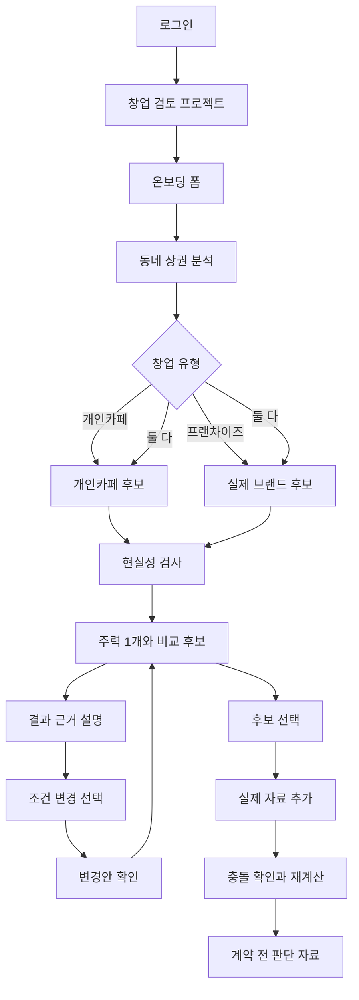

status:: main

# CaffeMate 제품 명세

> 구현 단계: active development
>
> 갱신일: 2026-08-23
>
> 범위: 대한민국 동네 단위 카페 창업 탐색부터 계약 전 판단 자료까지

## 1. 제품 목적

CaffeMate는 예비 창업자가 자신이 선택한 동네에서 자금과 운영 조건에 맞는 개인카페 또는 실제 가맹 가능한 프랜차이즈 창업안을 찾고, 선택한 안을 실제 자료로 구체화하도록 돕는 stateful decision system이다.

판단 순서는 고정한다.

```text
Hard Constraint
→ Economic Viability
→ Founder Fit
→ Risk-adjusted Ranking
```

가장 높은 예상매출 후보를 추천하는 제품이 아니다.

## 2. 대상 사용자와 지역

### CONFIRMED

- 퇴사를 고민하거나 이미 퇴사한 카페 창업 희망자
- 직장과 병행해 창업을 알아보는 사용자
- 개인카페, 프랜차이즈 또는 둘 다를 동네 수준에서 비교하려는 사용자
- 제품 범위는 대한민국 전국의 동네다.
- 사용자가 관심 지역을 먼저 지정한다.
- 전국에서 가장 좋은 동네를 자동 추천하는 기능은 첫 범위가 아니다.
- 수원 아주대학교 주변은 데모와 데이터 검증 지역일 뿐 제품 범위가 아니다.
- GCP 배포 리전은 제품 지원 지역을 뜻하지 않으며 전국 동네 지원 범위를 제한하지 않는다.

## 3. 제품 경계

### 포함

- 로그인과 복수 창업 검토 프로젝트
- 온보딩 폼
- 선택 동네 상권 기초 분석
- 개인카페 표준 운영 모델 후보
- 실제 가맹 가능한 프랜차이즈 브랜드 후보
- 개인카페와 프랜차이즈 비교
- 현실성 검사와 결과 카드
- 결과 이후 근거 기반 설명, 자연어 조건 변경과 변경 승인
- 실제 매물·견적·정보공개서·계약·대출 자료 반영
- 비용·위험·판단 재계산
- 계약 전 판단 자료
- 위생교육, 영업신고, 사업자등록과 시설 확인 안내

### 제외

- 인테리어 업체 탐색·선정과 공사 관리
- 장비 구매 실행
- 계약 체결, 송금, 결제와 대출 실행
- 법적으로 안전하다는 확정 판단
- 최종 창업 실행 결정
- 오픈 이후 재고·고객관리·마케팅 자동화
- 상세 일정 관리 제품

## 4. 사용자 흐름



## 5. 로그인과 프로젝트

### CONFIRMED

- 로그인한 사용자만 온보딩·저장 결과·문서 화면에 접근할 수 있다.
- 한 계정은 여러 개의 창업 검토 프로젝트를 만들 수 있다.
- 프로젝트별로 지역, 자금, 운영 조건, 후보, 문서, 가정, 계산과 판단 이력을 독립 보관한다.
- 프로젝트 전환 시 다른 프로젝트의 값을 합치거나 덮어쓰지 않는다.
- 한 번에 하나의 프로젝트만 활성화한다.

## 6. 온보딩

첫 분석에 필요한 네 묶음이다.

1. 희망 지역
2. 자기자금과 대출 고려 여부
3. 개인카페·프랜차이즈·둘 다 중 하나
4. 직접 전업·시간제 참여·직원 중심·미정 중 운영 방식

최대 손실액, 퇴사 여부, 창업 경험, 희망 개업일, 취향과 실제 매물은 선택 입력이다. `미정`은 오류가 아니라 유효한 값이다.

첫 결과가 나오기 전에는 자연어 피드백 채팅을 제공하지 않는다.

희망 지역은 표시 문자열만 저장하지 않는다. 브라우저는 Control API가 반환한 구조화 지역 후보를
사용자에게 보여주고, 사용자가 선택한 서명 토큰을 온보딩 확정 요청에 포함한다. Control API는
프로젝트, 검색어, 만료와 후보 식별자를 검증한 뒤 `AreaIdentity`를 권위 State에 저장한다.

- 법정동과 행정동 코드를 별도 필드로 유지한다.
- 법정동과 행정동의 관계가 확인되지 않았으면 `UNVERIFIED`로 표시하고 임의 매핑하지 않는다.
- 지역이 구조화되어 확정된 뒤에 첫 분석을 시작한다.
- 자유 입력이 바뀌면 이전 지역 선택은 즉시 무효화한다.
- 주소 검색 결과의 첫 페이지만으로 전국에서 유일한 후보라고 단정하지 않는다.

## 7. 상권 분석

상권 분석은 단독 보고서가 아니라 후보 생성과 현실성 검사의 입력이다.

첫 분석의 근거 조회 계획은 모델이 자유 생성하지 않는다. Control API가 Claim 종류별로
버전이 고정된 규칙을 적용해 MCP·RAG read action을 생성한다. 같은 Claim Plan과 도구
manifest는 같은 action plan과 digest를 만들어야 한다. Agent는 실행·검증된 조회 결과를
평가하지만 도구 선택, 지역 코드, 날짜 범위와 호출 상한을 정하지 않는다.

```text
Claim Plan
→ deterministic Evidence Plan
→ bounded parallel MCP·RAG retrieval
→ Evidence Assessment Agent
→ frozen Evidence Snapshot
```

- 알 수 없는 Claim 종류는 모델 추측으로 우회하지 않고 계약 오류로 중단한다.
- 정형 조회의 support·counter action이 같은 요청이면 물리 호출은 한 번만 수행하되 두
  논리 action과 polarity는 보존한다.
- 문서 RAG는 Claim별 고정 검색 목적과 source family 안에서만 실행한다.
- 자료가 없거나 connector가 제공되지 않으면 빈 성공값을 만들지 않고 missing·failed action으로
  남긴다.
- 병렬 조회 한 건이 실패해도 성공한 조회는 취소하지 않는다. 실패한 조회는 `ERROR` action과
  미확보 근거로 남기고, 확보된 근거만으로 Evidence Researcher와 후보 생성을 계속한다.

가능한 경우 다음을 표시한다.

- 행정동과 생활권
- 주민 인구와 연령 구성
- 카페 업소 현황과 경쟁 밀도
- 개인카페와 프랜차이즈 분포
- 신고 기준 신규·폐업 또는 변화 추세
- 매출·소비·유동·직장인구 자료의 값, 범위와 기준일
- 없거나 오래된 자료

### 금지

- 주민 인구를 유동인구로 표현하지 않는다.
- 원시 업소 행 수를 중복 제거된 실제 점포 수로 단정하지 않는다.
- 카페가 적다는 이유만으로 수요가 충분하다고 판정하지 않는다.
- 지역별 자료를 같은 품질의 전국 순위로 합치지 않는다.

## 8. 후보 생성

### Proposal Agent

- Proposal Agent는 frozen Evidence Snapshot, Founder State와 등록된 개인카페 모델·프랜차이즈 universe 안에서 후보안을 구조화한다.
- 개인카페는 근거가 있는 표준 운영 모델을 사용자 조건에 맞게 조정할 수 있다.
- 프랜차이즈는 확인된 실제 브랜드만 제안하며 존재하지 않는 브랜드·비용·매출을 생성하지 않는다.
- Proposal Agent는 후보를 만들 수 있지만 비용 계산, Hard Gate, 순위와 주력 후보 선택은 수행하지 않는다.
- Control API는 등록 후보마다 후보 1개짜리 AgentTask를 만들고 최대 3개를 병렬 실행한다. 각 Agent는 자신에게 배정된 후보 하나만 구조화하며, Control API가 결과를 합쳐 기존 결정론적 계산·Gate·순위 단계로 넘긴다.
- 개인카페 seed의 `support_refs`는 가정 근거이고 frozen Evidence의 `evidence_id`와 구분한다. Agent는 전자를 `assumption_refs`, 후자만 `evidence_refs`에 사용한다.
- 별도의 Typed Candidate Auditor가 Proposal 결과의 누락·무근거·충돌을 검사한다.

### 개인카페

- 자유 생성이 아니라 검증 가능한 표준 운영 모델을 기반으로 한다.
- 좌석·포장 비중, 면적, 메뉴 복잡도, 장비, 인테리어, 인력, 영업시간과 창업자 부담을 포함한다.
- 사용자의 취향과 결과 이후 피드백은 표준 모델의 조정값이다.
- 모델 근거 범위를 벗어난 숫자는 `추가 검토 필요`로 둔다.

### 프랜차이즈

- 첫 결과부터 실제 브랜드명을 표시한다.
- 개인 가맹 가능 여부가 확인된 브랜드만 추천 순위에 들어간다.
- 정보공개서나 비용·계약 자료 일부가 없어도 순위에 포함할 수 있다.
- CaffeMate 내부 계산·Gate를 확정하는 데 필요한 핵심 자료가 부족한 후보는 `조건부 검토`로 표시한다. 본사 주소 승인·관할기관 최종 확인처럼 외부 주체만 확정할 수 있는 항목은 별도 `외부 확인` 상태로 분리하며, 그것만으로 경제 검토 상태를 조건부로 낮추지 않는다.
- 누락값을 다른 브랜드 평균이나 업계 관행으로 채우지 않는다.
- 특정 동네 출점 가능 여부와 영업지역 보호는 확인 전 `본사 확인 필요`로 표시한다.
- 개인 가맹이 불가능한 직영 브랜드는 경쟁점 또는 참고 브랜드로만 사용한다.
- 본사 평균매출을 신규 점포 예상매출로 사용하지 않는다.

## 9. 참고 비용 범위

실제 견적이 없는 초기 단계에서는 출처가 표시된 참고 비용 범위를 사용할 수 있다.

- 비용, 인력, 면적과 장비에만 사용한다.
- 출처, 기준연도, 적용 대상, 포함·제외 항목을 표시한다.
- 특정 사용자 점포의 사실이나 확정 견적으로 표현하지 않는다.
- 예상매출, 예상 고객 수, 상권 수요와 성공확률에는 사용하지 않는다.
- 실제 견적이 들어오면 충돌을 표시하고 교체 제안을 만든다.

매출 자료가 없으면 예상매출 대신 사용자 가정 기반 손익분기 매출과 필요한 주문 수를 계산한다.

### 첫 제안용 개인카페 모델

첫 분석이 빈 후보로 끝나지 않도록 소형 포장 중심형, 중소형 균형형, 좌석 중심형 세 모델을
등록한다. 각 모델에는 비용 항목별 low·base·high, 공헌이익률, 월 영업일과 객단가의 임시
계산값이 버전과 함께 포함된다.

첫 분석에서는 등록된 모델 중 사용자 조건에 맞는 후보를 최대 세 개까지 한 번에 생성한다.
Control API는 개인카페와 프랜차이즈 후보를 같은 판단 순서로 계산하고, 전체 후보 중 주력 한 개와
비교 후보 두 개를 결과에 포함한다. 적격 후보가 부족하면 개수를 억지로 채우지 않는다.

이 값은 실제 상권 사실이나 견적이 아니라 `DECLARED_ASSUMPTION`이다. Proposal Agent는 사용자
운영 방식과 등록 범위 안에서 모델을 제안하고, Control API가 초기 필요자금·월 고정비·손익분기
매출·필요 주문 수를 계산한다. 같은 항목의 수용된 공식 자료나 사용자 확인 문서가 들어오면
임시 계산값보다 우선하며 결과를 다시 계산한다.

### 첫 제안용 이디야커피 기준

이디야커피 후보는 공식 가맹 개설비와 20평 인테리어·기기 비용을 회사 공식 자료로 연결한다.
공식 값은 20평 기준이고 부가가치세·임대차 비용이 별도라는 범위를 결과에 유지한다. 점포
보증금·권리금·월 임차비·인건비·운영 예비금은 실제 점포 자료가 들어오기 전까지만 데모 계산용
`DECLARED_ASSUMPTION`으로 사용한다. 실제 매물·견적·정보공개서에서 같은 항목이 확인되면 사용자
문서 값을 우선해 다시 계산한다. 공식 개설비 출처는
`https://www.ediya.com/C/contents/franchise_02.html`, 인테리어·기기 출처는
`https://www.ediya.com/C/contents/interior.html`이다.

## 10. 현실성 검사와 결과 상태

모든 후보는 다음 조사 비용을 들일 가치가 있는지 판단할 정도의 현실성 검사를 거친다.

| 상태 | 의미 |
| --- | --- |
| `검토 추천` | 현재 필수 조건을 충족하며 다음 조사 가치가 있음 |
| `조건부 검토` | CaffeMate 내부 계산·Gate의 핵심 입력이 부족하거나 특정 조건에서만 성립 |
| `제외` | 확인된 사실과 전체 현실적 범위에서 필수 조건을 충족할 수 없음 |

자료 부족 자체는 `제외` 사유가 아니다. 확인된 Hard Constraint 위반만 제외 근거가 된다.

`조건부 검토` 후보도 결과 순위에 포함할 수 있다. 이때 순위는 확정 경제성 순위가 아니라 현재 근거에서의 `다음 검토 우선순위`이며, 상태·누락값·판단 영향이 순위 바로 옆에 표시돼야 한다.

## 11. 첫 결과

- 기본 구조는 `주력 추천 1개 + 비교 후보 2개`다.
- 적격 후보가 부족하면 세 개를 억지로 채우지 않는다.
- 문서나 점포 조건을 반영한 뒤 모든 후보가 제외되면 이전 추천을 현재 결과처럼 남기지 않는다. 제외된 안과 확인된 위반 조건을 `현재 조건에서 진행하기 어려운 안`으로 새 결과에 저장하고, 순위·주력 후보 없이 조건 변경 행동을 제시한다.
- 주력 후보는 최종 창업 권고가 아니라 `다음 검토 추천`이다.
- 불완전한 후보가 주력이라면 `다음으로 확인할 가치가 가장 높은 후보`임을 명시한다.
- 결과 화면은 탭형 대시보드가 아니라 `결론 → 후보 비교 → 판정 이유 → 재무·근거 → 참고 상권 정보 → CaffeMate에서 더 정밀화할 입력 → 외부 확인 → 판단 반전 조건 → 다음 행동 → 결과 질문` 순서의 단일 읽기 흐름으로 제공한다.
- 결과의 미확정 항목은 하나의 `확인 필요`로 합치지 않는다. 사용자·문서 입력으로 CaffeMate가 다시 계산할 수 있는 항목, 외부 주체만 최종 확인할 수 있는 항목, 계산에 쓰지 않은 참고 자료를 서로 분리한다.
- 결과 카드에는 현재 판단, 근거, 알려지지 않은 값, 비용 범위, 위험, 판단 반전 조건과 다음 행동을 표시한다.
- 수용·동결된 공식 문서 근거는 출처 제목, 원문 주소, 기준일, 후보에 연결된 근거 참조를 함께 표시한다. 창업 절차·계약 확인·정보공개서 중 검색되었거나 수용된 문서가 없는 범주는 추정해서 채우지 않고 `공식 문서 미확보`로 표시한다.
- 개인카페와 프랜차이즈를 같은 비용·상권·운영 부담·위험 축으로 비교한다.
- 조건부 후보는 `2순위 — 조건부 검토`처럼 순위와 상태를 함께 표시하고, CaffeMate 내부의 어떤 계산·Gate를 미확인 값 때문에 확정할 수 없는지 바로 보여준다. 외부 확인 항목은 같은 상태 배지에 섞지 않는다.
- `검토 추천` 순위는 경제 조건과 등록된 운영안의 명시적 제약·운영 부담을 비교하고, `조건부 검토` 순위는 다음 검토 우선순위다. 등록 운영안과의 충돌을 창업자 개인의 적성 판정처럼 표현하지 않으며, 두 순위 의미를 같은 확정 순위처럼 표현하지 않는다.

### 결과 화면의 자금 안내

- 자기자금이 후보의 최소 필요자금보다 적으면 일반적인 `조건부 검토` 문구보다 현재 자금과 최소 부족액을 먼저 보여준다.
- 이때 현재 운영안이 자기자금만으로 어렵다는 뜻과 카페 창업 전체가 불가능하다는 뜻을 구분한다.
- 다음 행동은 `대상 선택`이 아니라 예산에 가까운 작은 운영안 검토, 추가 자금 조건 입력 또는 실제 점포 비용 확인으로 안내한다.
- 계산에 필요한 기본 가정이 채워진 상태를 실제 점포와 견적이 확인된 상태로 표현하지 않는다.
- 공식 상권 자료, 등록된 기본 가정, 지역 벤치마크, 실제 점포 자료와 실제 견적의 범위를 사용자가 구분할 수 있어야 한다. 계산에 사용한 값은 해당 숫자 옆에 출처·기준일·적용 범위를 표시하고, 계산에 쓰지 않은 상권 지표는 `참고 정보`로 분리한다.
- 프론트엔드는 자금 Gate, 순위 또는 판정 변화를 다시 계산하지 않는다. 공개 Result의 구조화된 decision/gate trace, rank trace와 causal decision delta를 사용자 언어로 조직해 보여준다.
- 감사 상태, 자료 범위 코드와 내부 식별자는 사용자 화면에 표시하지 않는다.

## 12. 결과 피드백

- 첫 결과 이후에만 자연어 피드백을 받는다.
- 결과 화면은 먼저 확정된 결과와 근거를 읽는 작업 공간이며, `결과에 대해 물어보기`는 전체 판단·근거·다음 행동 뒤에 배치하는 보조 작업 공간이다.
- 설명 질문은 왜 이 후보를 먼저 보는지, 후보가 어떻게 다른지, 비용이 어떻게 계산됐는지, 숫자의 출처가 무엇인지, 무엇이 아직 확인되지 않았는지, 어떤 조건에서 판단이 바뀌는지를 다룬다.
- 설명 Agent는 현재 Result Bundle의 선택 후보·비교 후보·재무 계산·누락값·위험·반전 조건과 그 안에 연결된 Evidence만 읽는다. 검색이나 State 변경 권한은 없다.
- 모델이 반환한 Evidence ID는 Control API가 현재 결과의 허용 근거 목록과 다시 대조하고, 일치한 출처만 사용자 답변에 붙인다.
- 설명 질문만으로 Founder State, Venture State, 후보, 순위와 결과를 바꾸지 않는다.
- 조건 변경은 같은 작업 공간의 보조 행동 `조건 바꾸기`로 분리한다.
- 조건 변경 입력만 현재 State에 대한 변경 제안으로 해석한다.
- 변경 전후 차이를 보여주고 사용자가 확인한 뒤에만 반영한다.
- 확인 전에는 기존 State와 결과를 바꾸지 않는다.
- 반영 후 영향받는 검색·후보·계산만 재실행한다.

## 13. 후보 구체화

사용자가 주력 또는 비교 후보를 선택하면 `실제 점포 조건 → 견적·계약 숫자 → 새 조건으로 다시 판단 → 외부 확인 → 공식 창업 준비 절차` 순서로 후보를 구체화한다. 단계는 다시 방문할 수 있지만 첫 결과와 공식 절차를 한 화면에 동시에 펼치지 않는다. 공식 창업 절차는 마지막 단계에 진입할 때 조회한다.

다음 자료를 추가할 수 있다.

- 실제 매물과 임대 조건
- 정보공개서와 가맹계약서
- 본사 상담 조건
- 장비·인테리어 견적
- 대출 조건
- 영업신고와 시설 확인 자료

자료가 들어오면 사실 추출, 기존 가정 충돌, 재무·위험 재계산, 판단 변화 설명 순서로 처리한다. 핵심 자료가 부족해도 빈 화면으로 끝내지 않고 `검토 필요` 결과와 다음 확인 자료를 제공한다.

OCR·문서 분석 결과는 필드별 확인 팝업이 아니라 한 화면의 자동 입력 폼으로 제공한다.

- 추출 가능한 필드는 원문 anchor와 함께 미리 채운다.
- 사용자는 모든 자동 입력값을 직접 수정하거나 비울 수 있다.
- 애매하거나 충돌한 값은 추측해 채우지 않고 경고와 빈 필드로 표시한다.
- 사용자는 필드마다 `맞음`을 누르지 않는다.
- 사용자가 `반영하고 다시 계산`을 한 번 누르면 현재 문서 revision과 State version을 확인한 뒤 폼 전체를 하나의 원자적 변경으로 적용한다.
- 적용 전에는 기존 State·비용·Gate·순위를 변경하지 않는다.
- 데모에 포함된 여섯 문서는 파일명과 자료 종류가 일치할 때만 결정론적 예시 추출기를 사용한다. 이 경로도 실제 업로드·수정 폼·State 반영·선택적 재계산 계약을 그대로 통과해야 하며, 결과 화면에는 예시 자료임을 표시한다.
- 임의 사용자 문서는 데모 추출값으로 대체하지 않고 문서 검사와 Document Agent 경로를 사용한다. 처리 지연이나 실패 시 내부 상태 코드를 노출하지 않고 같은 화면에서 재시도할 행동을 안내한다.

## 14. 인간 결정 경계

다음은 항상 인간에게 남긴다.

- 계약 체결
- 송금과 결제
- 대출 실행
- 법적 확정 판단
- 고액 지출
- 최종 창업 실행 결정

## 15. 최소 수용 기준

- 사용자는 로그인 뒤 여러 프로젝트를 독립적으로 생성·전환할 수 있다.
- 온보딩 네 묶음만으로 첫 분석을 시작할 수 있다.
- 상권 분석은 후보 근거로 연결된다.
- 개인 가맹이 확인되지 않은 브랜드는 추천 순위에 들어가지 않는다.
- CaffeMate 내부 계산에 필요한 핵심 자료가 불완전한 실제 브랜드는 `조건부 검토`로 순위에 들어갈 수 있다. 외부 확인만 남은 브랜드는 계산 상태와 외부 확인 상태를 분리한다.
- 조건부 후보의 카드에는 순위, `조건부 검토`, 내부 계산에 필요한 누락값과 다음 확인 행동이 동시에 표시된다.
- 확인할 수 없는 매출·고객 수·폐점률·임대료를 생성하지 않는다.
- 결과의 중요한 사실에는 출처·기준일·범위가 있다.
- 참고 비용 범위와 사용자 사실을 시각적으로 구분한다.
- 자연어 피드백은 사용자 확인 뒤에만 반영된다.
- 새 문서는 기존 가정과 충돌을 표시하고 영향받은 계산만 갱신한다.
- OCR 결과는 수정 가능한 자동 입력 폼으로 표시되며, 필드별 확인 없이 한 번의 일괄 반영 뒤에만 State와 계산이 갱신된다.
- 법률·계약·금전 행동은 자동 실행하지 않는다.

## 16. 확정 Runtime과 리전

- ADK Multi-Agent application은 GCP managed Agent Runtime에 배포한다.
- Agent Runtime과 embedding 호출은 `asia-northeast3`를 사용하고, Gemini 생성 모델은 명시적으로 `global` endpoint의 `gemini-3.7-flash`를 사용한다.
- `global`은 fallback이 아니라 승인된 생성 위치다. Runtime·RAG·embedding을 다른 위치로 자동 전환하거나 생성 모델을 다른 endpoint로 조용히 fallback하지 않는다.
- 승인 모델 또는 quota를 `global`에서 사용할 수 없으면 `BLOCKED_BY_REGION`으로 중단하고 모델·위치 변경을 별도 승인받는다.
- Control API가 IAM 인증으로 Agent Runtime을 직접 호출한다.
- 서울 리전에서 지원되지 않는 managed Agent Gateway를 사용하지 않는다.
- Agent는 Control API가 고정한 현재 State snapshot을 읽고 typed proposal 또는 State delta를 반환한다. Agent Runtime session은 임시 실행 문맥일 뿐 제품 State가 아니다.
- Agent와 MCP는 권위 State를 직접 수정하지 않는다. Schema·근거·버전 검증을 통과한 변경만 Control API의 단일 reducer가 영구 반영한다.
- Vertex AI RAG Engine을 공식 문서·정보공개서·사용자 문서 Advanced RAG의 주 검색 계층으로 사용한다.
- `asia-northeast3` RAG Engine의 Preview 위험은 본 프로젝트에서 수용한다. 배포 전 corpus 생성, 문서 import, retrieval과 rerank 실제 호출을 각각 검증한다.
- RAG Engine 실패를 Cloud SQL `pgvector`나 다른 리전으로 조용히 우회하지 않는다. 필수 사전 검증이 실패하면 문서 RAG 경로를 `BLOCKED_BY_REGION` 또는 `RAG_UNAVAILABLE`로 중단한다.
- 인구·카페 수·개폐업·매출 관측처럼 계산에 쓰이는 정형 수치는 RAG가 아니라 검증된 API·BigQuery·SQL Tool로 조회한다.
- `EVIDENCE_ASSESS`는 근거의 의미 관계·범위·시점·권위를 판정하는 필수 관리형 Agent 단계다.
  Runtime 실패를 성공이나 결정론적 Agent 대체값으로 바꾸지 않는다. 실패는 원래 Runtime code와
  trace를 보존한 명시적 Stage 실패로 남기며, 조회 record를 검증된 Evidence로 승격하지 않는다.
- Agent에는 완전한 조회 저장본이 아니라 의미 판정에 필요한 bounded projection만 보낸다. 동일
  Claim과 물리 요청의 중복 결과는 한 번만 전달하고, action별 rerank 상위 세 Evidence candidate만
  포함하며 공급자 원시 data row는 제외한다. 완전한 MCP 결과는 Control API가 별도로 보존하여
  Evidence Freeze와 후보 입력에서 사용한다.
- 역할별 생성 예산을 고정한다. Intent·Evidence 평가는 `low`, Proposal·Document·Candidate
  Audit은 `medium` 사고 수준을 사용한다. 이는 Agent를 제거하는 최적화가 아니라 역할의 인지적
  난이도에 맞춰 지연과 `MAX_TOKENS` 실패를 제한하는 설정이다.

## 17. 현재 미결정 또는 검증 필요

- 전국 connector별 실제 응답·갱신주기·공간 결합 품질
- `검토 필요`보다 강한 준비 상태에 필요한 최소 자료 묶음
- 실제 사용자 가치와 지불 의향
- 개인카페 표준 운영 모델의 실제 범위와 비용 자료 표본
- 프랜차이즈 개인 가맹 가능 여부를 자동 확인할 공식 경로
