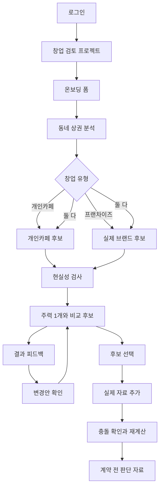

# CaffeMate 제품 명세

> 상태: active development contract
>
> 갱신일: 2026-08-21
>
> 범위: 대한민국 동네 단위 카페 창업 탐색부터 계약 전 판단 자료까지

## 1. 제품 목적

CaffeMate는 예비 창업자가 자신이 선택한 동네에서 자금과 운영 조건에 맞는 개인카페 또는 실제 가맹 가능한 프랜차이즈 창업안을 찾고, 선택한 안을 실제 자료로 구체화하도록 돕는 stateful decision system이다.

판단 순서는 고정한다.

```text
Hard Constraint
→ Economic Viability
→ Founder Fit
→ Risk-adjusted Ranking
```

가장 높은 예상매출 후보를 추천하는 제품이 아니다.

## 2. 대상 사용자와 지역

### CONFIRMED

- 퇴사를 고민하거나 이미 퇴사한 카페 창업 희망자
- 직장과 병행해 창업을 알아보는 사용자
- 개인카페, 프랜차이즈 또는 둘 다를 동네 수준에서 비교하려는 사용자
- 제품 범위는 대한민국 전국의 동네다.
- 사용자가 관심 지역을 먼저 지정한다.
- 전국에서 가장 좋은 동네를 자동 추천하는 기능은 첫 범위가 아니다.
- 수원 아주대학교 주변은 데모와 데이터 검증 지역일 뿐 제품 범위가 아니다.
- GCP 배포 리전은 제품 지원 지역을 뜻하지 않으며 전국 동네 지원 범위를 제한하지 않는다.

## 3. 제품 경계

### 포함

- 로그인과 복수 창업 검토 프로젝트
- 온보딩 폼
- 선택 동네 상권 기초 분석
- 개인카페 표준 운영 모델 후보
- 실제 가맹 가능한 프랜차이즈 브랜드 후보
- 개인카페와 프랜차이즈 비교
- 현실성 검사와 결과 카드
- 결과 이후 자연어 피드백과 변경 승인
- 실제 매물·견적·정보공개서·계약·대출 자료 반영
- 비용·위험·판단 재계산
- 계약 전 판단 자료
- 위생교육, 영업신고, 사업자등록과 시설 확인 안내

### 제외

- 인테리어 업체 탐색·선정과 공사 관리
- 장비 구매 실행
- 계약 체결, 송금, 결제와 대출 실행
- 법적으로 안전하다는 확정 판단
- 최종 창업 실행 결정
- 오픈 이후 재고·고객관리·마케팅 자동화
- 상세 일정 관리 제품

## 4. 사용자 흐름



## 5. 로그인과 프로젝트

### CONFIRMED

- 로그인한 사용자만 온보딩·저장 결과·문서 화면에 접근할 수 있다.
- 한 계정은 여러 개의 창업 검토 프로젝트를 만들 수 있다.
- 프로젝트별로 지역, 자금, 운영 조건, 후보, 문서, 가정, 계산과 판단 이력을 독립 보관한다.
- 프로젝트 전환 시 다른 프로젝트의 값을 합치거나 덮어쓰지 않는다.
- 한 번에 하나의 프로젝트만 활성화한다.

## 6. 온보딩

첫 분석에 필요한 네 묶음이다.

1. 희망 지역
2. 자기자금과 대출 고려 여부
3. 개인카페·프랜차이즈·둘 다 중 하나
4. 직접 전업·시간제 참여·직원 중심·미정 중 운영 방식

최대 손실액, 퇴사 여부, 창업 경험, 희망 개업일, 취향과 실제 매물은 선택 입력이다. `미정`은 오류가 아니라 유효한 값이다.

첫 결과가 나오기 전에는 자연어 피드백 채팅을 제공하지 않는다.

## 7. 상권 분석

상권 분석은 단독 보고서가 아니라 후보 생성과 현실성 검사의 입력이다.

가능한 경우 다음을 표시한다.

- 행정동과 생활권
- 주민 인구와 연령 구성
- 카페 업소 현황과 경쟁 밀도
- 개인카페와 프랜차이즈 분포
- 신고 기준 신규·폐업 또는 변화 추세
- 매출·소비·유동·직장인구 자료의 값, 범위와 기준일
- 없거나 오래된 자료

### 금지

- 주민 인구를 유동인구로 표현하지 않는다.
- 원시 업소 행 수를 중복 제거된 실제 점포 수로 단정하지 않는다.
- 카페가 적다는 이유만으로 수요가 충분하다고 판정하지 않는다.
- 지역별 자료를 같은 품질의 전국 순위로 합치지 않는다.

## 8. 후보 생성

### 개인카페

- 자유 생성이 아니라 검증 가능한 표준 운영 모델을 기반으로 한다.
- 좌석·포장 비중, 면적, 메뉴 복잡도, 장비, 인테리어, 인력, 영업시간과 창업자 부담을 포함한다.
- 사용자의 취향과 결과 이후 피드백은 표준 모델의 조정값이다.
- 모델 근거 범위를 벗어난 숫자는 `추가 검토 필요`로 둔다.

### 프랜차이즈

- 첫 결과부터 실제 브랜드명을 표시한다.
- 개인 가맹 가능 여부가 확인된 브랜드만 추천 순위에 들어간다.
- 정보공개서나 비용·계약 자료 일부가 없어도 순위에 포함할 수 있다.
- 누락 자료가 있는 후보는 `조건부 검토`로 표시한다.
- 누락값을 다른 브랜드 평균이나 업계 관행으로 채우지 않는다.
- 특정 동네 출점 가능 여부와 영업지역 보호는 확인 전 `본사 확인 필요`로 표시한다.
- 개인 가맹이 불가능한 직영 브랜드는 경쟁점 또는 참고 브랜드로만 사용한다.
- 본사 평균매출을 신규 점포 예상매출로 사용하지 않는다.

## 9. 참고 비용 범위

실제 견적이 없는 초기 단계에서는 출처가 표시된 참고 비용 범위를 사용할 수 있다.

- 비용, 인력, 면적과 장비에만 사용한다.
- 출처, 기준연도, 적용 대상, 포함·제외 항목을 표시한다.
- 특정 사용자 점포의 사실이나 확정 견적으로 표현하지 않는다.
- 예상매출, 예상 고객 수, 상권 수요와 성공확률에는 사용하지 않는다.
- 실제 견적이 들어오면 충돌을 표시하고 교체 제안을 만든다.

매출 자료가 없으면 예상매출 대신 사용자 가정 기반 손익분기 매출과 필요한 주문 수를 계산한다.

## 10. 현실성 검사와 결과 상태

모든 후보는 다음 조사 비용을 들일 가치가 있는지 판단할 정도의 현실성 검사를 거친다.

| 상태 | 의미 |
| --- | --- |
| `검토 추천` | 현재 필수 조건을 충족하며 다음 조사 가치가 있음 |
| `조건부 검토` | 핵심 자료가 부족하거나 특정 조건에서만 성립 |
| `제외` | 확인된 사실과 전체 현실적 범위에서 필수 조건을 충족할 수 없음 |

자료 부족 자체는 `제외` 사유가 아니다. 확인된 Hard Constraint 위반만 제외 근거가 된다.

## 11. 첫 결과

- 기본 구조는 `주력 추천 1개 + 비교 후보 2개`다.
- 적격 후보가 부족하면 세 개를 억지로 채우지 않는다.
- 주력 후보는 최종 창업 권고가 아니라 `다음 검토 추천`이다.
- 불완전한 후보가 주력이라면 `다음으로 확인할 가치가 가장 높은 후보`임을 명시한다.
- 결과 카드에는 현재 판단, 근거, 알려지지 않은 값, 비용 범위, 위험, 판단 반전 조건과 다음 행동을 표시한다.
- 개인카페와 프랜차이즈를 같은 비용·상권·운영 부담·위험 축으로 비교한다.

## 12. 결과 피드백

- 첫 결과 이후에만 자연어 피드백을 받는다.
- 결과 화면의 작업 공간에 피드백 UI를 항상 표시한다.
- 피드백은 현재 State에 대한 변경 제안으로 해석한다.
- 변경 전후 차이를 보여주고 사용자가 확인한 뒤에만 반영한다.
- 확인 전에는 기존 State와 결과를 바꾸지 않는다.
- 반영 후 영향받는 검색·후보·계산만 재실행한다.

## 13. 후보 구체화

사용자가 주력 또는 비교 후보를 선택하면 다음 자료를 추가할 수 있다.

- 실제 매물과 임대 조건
- 정보공개서와 가맹계약서
- 본사 상담 조건
- 장비·인테리어 견적
- 대출 조건
- 영업신고와 시설 확인 자료

자료가 들어오면 사실 추출, 기존 가정 충돌, 재무·위험 재계산, 판단 변화 설명 순서로 처리한다. 핵심 자료가 부족해도 빈 화면으로 끝내지 않고 `검토 필요` 결과와 다음 확인 자료를 제공한다.

## 14. 인간 결정 경계

다음은 항상 인간에게 남긴다.

- 계약 체결
- 송금과 결제
- 대출 실행
- 법적 확정 판단
- 고액 지출
- 최종 창업 실행 결정

## 15. 최소 수용 기준

- 사용자는 로그인 뒤 여러 프로젝트를 독립적으로 생성·전환할 수 있다.
- 온보딩 네 묶음만으로 첫 분석을 시작할 수 있다.
- 상권 분석은 후보 근거로 연결된다.
- 개인 가맹이 확인되지 않은 브랜드는 추천 순위에 들어가지 않는다.
- 자료가 불완전한 실제 브랜드는 `조건부 검토`로 순위에 들어갈 수 있다.
- 확인할 수 없는 매출·고객 수·폐점률·임대료를 생성하지 않는다.
- 결과의 중요한 사실에는 출처·기준일·범위가 있다.
- 참고 비용 범위와 사용자 사실을 시각적으로 구분한다.
- 자연어 피드백은 사용자 확인 뒤에만 반영된다.
- 새 문서는 기존 가정과 충돌을 표시하고 영향받은 계산만 갱신한다.
- 법률·계약·금전 행동은 자동 실행하지 않는다.

## 16. 현재 미결정 또는 검증 필요

- 전국 connector별 실제 응답·갱신주기·공간 결합 품질
- `검토 필요`보다 강한 준비 상태에 필요한 최소 자료 묶음
- 실제 사용자 가치와 지불 의향
- 개인카페 표준 운영 모델의 실제 범위와 비용 자료 표본
- 프랜차이즈 개인 가맹 가능 여부를 자동 확인할 공식 경로
